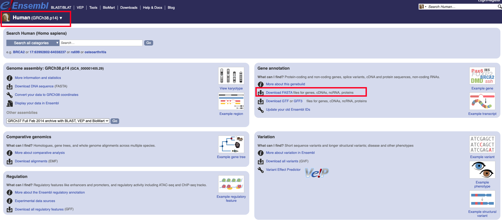
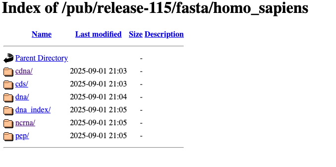
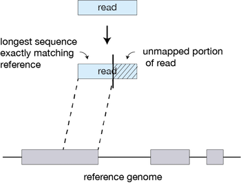
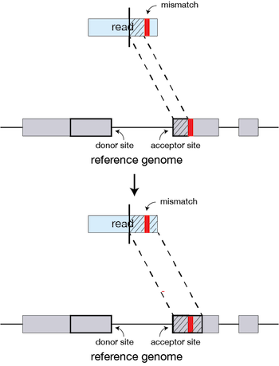
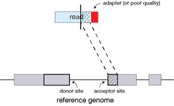
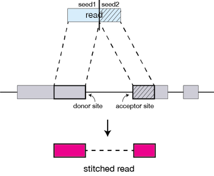
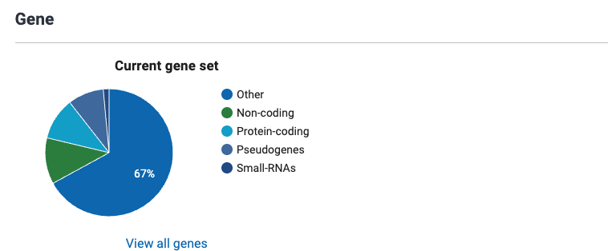
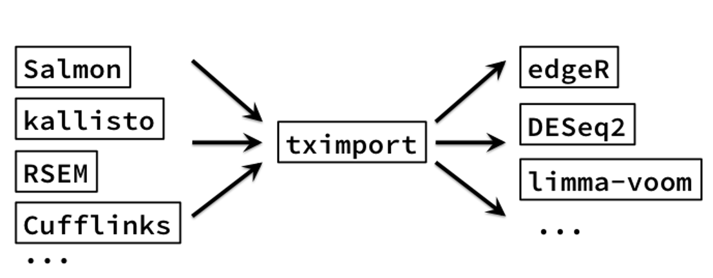
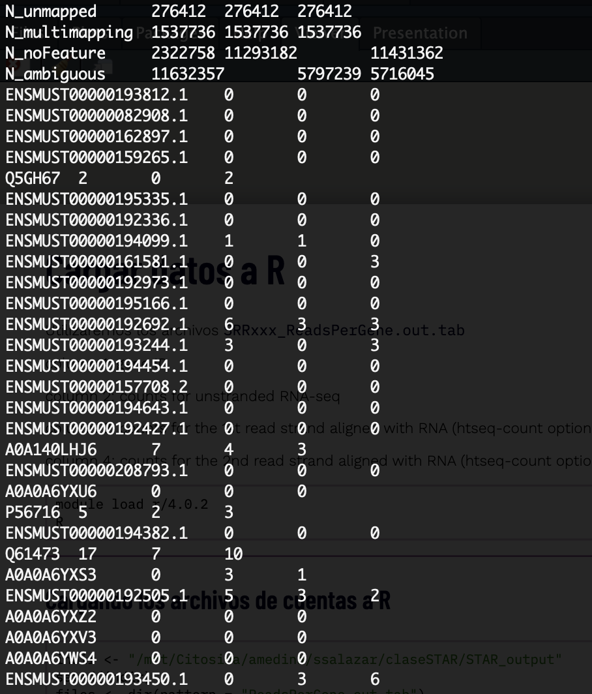

```{r setup, include = FALSE}
# Setup chunk
# Paquetes a usar
#options(htmltools.dir.version = FALSE) cambia la forma de incluir código, los colores

library(knitr)
library(tidyverse)
library(xaringanExtra)
library(icons)
library(fontawesome)
library(emo)

# set default options
opts_chunk$set(collapse = TRUE,
               dpi = 300,
               warning = FALSE,
               error = FALSE,
               comment = "#")

top_icon = function(x) {
  icons::icon_style(
    icons::fontawesome(x),
    position = "fixed", top = 10, right = 10
  )
}

knit_engines$set("yaml", "markdown")

# Con la tecla "O" permite ver todas las diapositivas
xaringanExtra::use_tile_view()
# Agrega el boton de copiar los códigos de los chunks
xaringanExtra::use_clipboard()

# Crea paneles impresionantes 
xaringanExtra::use_panelset()

# Para compartir e incrustar en otro sitio web
xaringanExtra::use_share_again()
xaringanExtra::style_share_again(
  share_buttons = c("twitter", "linkedin")
)

# Funcionalidades de los chunks, pone un triangulito junto a la línea que se señala
xaringanExtra::use_extra_styles(
  hover_code_line = TRUE,         #<<
  mute_unhighlighted_code = TRUE  #<<
)

# Agregar web cam
xaringanExtra::use_webcam()
```

```{r xaringan-editable, echo=FALSE}
# Para tener opciones para hacer editable algun chunk
xaringanExtra::use_editable(expires = 1)
# Para hacer que aparezca el lápiz y goma
xaringanExtra::use_scribble()
```


```{r xaringan-themer Eve, include=FALSE, warning=FALSE}
# Establecer colores para el tema
library(xaringanthemer)

palette <- c(
 orange        = "#fb5607",
 pink          = "#ff006e",
 blue_violet   = "#8338ec",
 zomp          = "#38A88E",
 shadow        = "#87826E",
 blue          = "#1381B0",
 yellow_orange = "#FF961C"
  )

#style_xaringan(
style_duo_accent(
  background_color = "#FFFFFF", # color del fondo
  link_color = "#562457", # color de los links
  text_bold_color = "#0072CE",
  primary_color = "#01002B", # Color 1
  secondary_color = "#CB6CE6", # Color 2
  inverse_background_color = "#00B7FF", # Color de fondo secundario 
  colors = palette,
  
  # Tipos de letra
  header_font_google = google_font("Barlow Condensed", "600"), #titulo
  text_font_google   = google_font("Work Sans", "300", "300i"), #texto
  code_font_google   = google_font("IBM Plex Mono") #codigo
  #text_font_size = "1.5rem" # Tamano de letra
)
# https://www.rdocumentation.org/packages/xaringanthemer/versions/0.3.4/topics/style_duo_accent
```

class: title-slide, middle, center
background-image: url(figures/HelloWorld_slide1.png)
background-position: 90% 75%, 75% 75%, center
background-size: 1210px,210px, cover

.center-column[
# `r rmarkdown::metadata$title`
### `r rmarkdown::metadata$subtitle`

####`r rmarkdown::metadata$author` 
#### `r rmarkdown::metadata$date`
]

.left[.footnote[R-Ladies Theme[R-Ladies Theme](https://www.apreshill.com/project/rladies-xaringan/)]]

---

# Contenido de la clase

- 1) Fuentes de error

- 2) Pipelines `Kallisto` y `STAR`

- 3) Importar datos de `kallisto` a R

- 4) Importar datos de `STAR` a R


---

class: inverse, center, middle

`r fontawesome::fa("bug", height = "3em")`
# 1. Fuentes de error

---

# Fuentes de error

Existen dos fuentes principales de error:

- **Error humano:** mezcla de muestras (en el laboratorio o cuando se recibieron los archivos), errores en el protocolo.

- **Error técnico:** Errores inherentes a la plataforma (e.g. secuencias de mononucleótidos en pyrosecuenciacion) –

Todas las plataformas tienen cierto de nivel de error que se debe tomar en cuenta cuando se está diseñando el experimento. 

---

# Errores en preparación de la **muestra**

- **Errores del usuario:** Etiquetado incorrecto de la muestra.

- **Degradación de ADN/ARN:** Causada por métodos inadecuados de preservación o manipulación.

- **Contaminación con secuencias externas:** Introducción de material genético ajeno a la muestra.

- **Baja cantidad de ADN/ARN de inicio:** Insuficiente material genético para una preparación adecuada de la biblioteca.

---

# Errores en preparación de las **bibliotecas**

- **Errores del usuario:** Contaminación entre muestras, contaminación con productos de reacciones previas, fallos en la ejecución del protocolo.

- **Errores de amplificación por PCR:** Introducción de artefactos debido a amplificación ineficiente o excesiva.

- **Sesgo por cebadores (primers):** Incluye sesgo de unión, sesgo por metilación y formación de dímeros de cebadores.

- **Sesgo por captura:** Derivado del uso de estrategias como Poly-A o Ribozero.

- **Errores de la máquina:** Configuración incorrecta del equipo o interrupción de la reacción.

- **Quimeras:** Artefactos generados por recombinación errónea de secuencias durante la amplificación.

- **Errores en índices y adaptadores:** Contaminación con adaptadores, baja diversidad de índices, códigos de barras (barcodes) incompatibles o sobrecarga de muestras.

---

# Errores de **secuenciación**

- **Errores del usuario:** Sobrecarga de la celda de secuenciación.

- **Desfase:** Extensión incompleta de la cadena o incorporación de múltiples nucleótidos en un solo ciclo.

- **Problemas con fluoróforos y nucleótidos:** Fluoróforos muertos, nucleótidos dañados o señales superpuestas que afectan la lectura.

- **Efecto del contexto de la secuencia:** Errores inducidos por alto contenido de GC, secuencias homólogas o de baja complejidad, y presencia de homopolímeros.

- **Errores de la máquina:** Fallos en componentes como láser, disco duro o software.

- **Sesgos de cadena:** Preferencia en la secuenciación de una de las hebras del ADN.

---

# El reto: Diferenciación entre señales **biológicas y ruido/errores**

- **Controles positivos y negativos:** Definir expectativas claras para identificar desviaciones inesperadas. ¿Qué espero?

- **Réplicas técnicas y biológicas**: Permiten estimar la tasa de ruido y evaluar la reproducibilidad de los datos.

- **Conocimiento de errores específicos de la plataforma:** Identificar patrones de error característicos de la tecnología utilizada para minimizar su impacto en el análisis.

---

class: inverse, center, middle

`r fontawesome::fa("circle-nodes", height = "3em")`
# 2. Pipelines de kallisto: Ensamblaje de **transcriptoma guiado**

---

## [**Kallisto**](https://pachterlab.github.io/kallisto/manual)

.pull-left[
- Se basa en la probabilidad de asignación correcta de las lecturas a un transcrito.

- **Pseudoalineamiento**.

- Es rápido.

- Se puede ejecutar el programa desde tu computadora.

- Se basa en los grafos de Brujin Graph (T-DBG) .

- Los Nodos (v1,v2,v3) son *k-mers*.

- Omite pasos redundantes en el T-DBG.

]

.pull-right[
```{r, echo=FALSE, out.width='80%', fig.align='center'}
knitr::include_graphics("figures/alignment_kallisto.png")
```
]

.right[.footnote[
[Bray, *et al*. 2016. *Nature*](https://www.nature.com/articles/nbt.3519)]]

---

## Pipeline con **Kallisto**: Ensamblaje de transcriptoma guiado

- Input:
  + Transcriptoma de referencia
  + Archivos `fastq` provenientes de la secuenciación

- Pipeline general:
  + Paso 1. Selección y preparación del transcriptoma de referencia
  + Paso 2. Indexar el transcriptoma de referencia creando un índice con Kallisto
  + Paso 3. Pseudoalineamiento con Kallisto
  
---

## Transcriptoma de referencia en Ensembl

Yo usare los siguientes:

- [Homo_sapiens.GRCh38.cdna.all.fa.gz](https://ftp.ensembl.org/pub/release-115/fasta/homo_sapiens/cdna/Homo_sapiens.GRCh38.cdna.all.fa.gz) → todos los transcritos codificantes (con isoformas y UTRs).
- [Homo_sapiens.GRCh38.ncrna.fa.gz](https://ftp.ensembl.org/pub/release-115/fasta/homo_sapiens/ncrna/Homo_sapiens.GRCh38.ncrna.fa.gz) → todos los transcritos no codificantes (lncRNA, miRNA, snoRNA, etc.).

La idea es **unirlos en un solo FASTA** para que *Kallisto* tenga un transcriptoma completo (codificante + no codificante).

---

## Descarga del Transcriptoma de referencia en Ensembl

Me fije que fuera el genoma de referencia [GRCh38.p14/hg38](https://www.ncbi.nlm.nih.gov/datasets/genome/GCF_000001405.40/) (Feb 3, 2022) (FASTA) proveniente de NCBI. Y Seleccione donde dice `Download FASTA`:

```{r, echo=FALSE, out.width='80%', fig.align='center'}

```

---

## Descarga del Transcriptoma de referencia en Ensembl

Posteriormente se desplego la [siguiente ventana](https://ftp.ensembl.org/pub/release-115/fasta/homo_sapiens/) y seleccione las carpetas `cdna` y `ncrna`:

```{r, echo=FALSE, out.width='80%', fig.align='center'}

```

---

### Pipeline con **Kallisto**

### Paso 1. Descargar ambos archivos con `wget`

```{bash, eval=F}
cd reference
# Genes codificantes
wget https://ftp.ensembl.org/pub/release-115/fasta/homo_sapiens/cdna/Homo_sapiens.GRCh38.cdna.all.fa.gz
# Genes no codificantes
wget https://ftp.ensembl.org/pub/release-115/fasta/homo_sapiens/ncrna/Homo_sapiens.GRCh38.ncrna.fa.gz
```

### Paso 2. Unirlos en un solo archivo FASTA

```{bash, eval=F}
cat Homo_sapiens.GRCh38.cdna.all.fa.gz Homo_sapiens.GRCh38.ncrna.fa.gz > Homo_sapiens.GRCh38.transcripts.fa.gz
```

Aquí simplemente concatenas ambos archivos comprimidos.

---

### Pipeline con **Kallisto**

### Paso 3. Generar el index con Kallisto

```{bash, eval = F}
# Crear la carpeta
mkdir kallisto_quant
# Cargar modulo
module load kallisto/0.45.0
# Generar index de kallisto
kallisto index -i transcripts.idx Homo_sapiens.GRCh38.transcripts.fa.gz
```

Argumentos:

- `-i`: nombre del archivo de salida, i.e., indice
- `Input`: At_stringm_seq_v2.fasta, transcriptoma de referencia

Si quieren intentarlo con *Arabidopsis thaliana* les dejo el curso que di en 2023 - [RNAseq_classFEB2023](https://github.com/EveliaCoss/RNAseq_classFEB2023/tree/main/RNA_seq).

---

### Pipeline con **Kallisto**

### Paso 4. Pseudoalineamiento con Kallisto

.pull-left[
- ***Single-end***

```{bash, eval = F}
# Single-end
for file in ./data/processed/*_trimmed.fq.gz
do
  base=$(basename "$file" _trimmed.fq.gz)   # Ej: SRR27190676_1
  kallisto quant --index ./align/kallisto/transcripts.idx \
                 --output-dir ./align/kallisto/kallisto_quant/${base} \
                 --threads 12 \
                 --single -l 200 -s 20 "$file"
done

# Nota: Debes poner --single -l -s, obligatorio.
```

Puedes tener este ERROR porque no colocas `--single -l -s`,
`Error: fragment length mean and sd must be supplied for single-end reads using -l and -s`.
]

.pull-right[
- ***Paired-end***
```{bash, eval = F}
# Paired-end
for file in ./data/processed/*1_trimmed.fq.gz
do
  base=$(basename "$file" _1_trimmed.fq.gz)   # Ej: SRR27190676
  file_1="./data/processed/${base}_1_trimmed.fq.gz"
  file_2="./data/processed/${base}_2_trimmed.fq.gz"
  
  kallisto quant --index ./align/kallisto/transcripts.idx \
                 --output-dir ./align/kallisto/kallisto_quant/${base} \
                 --threads 12 "$file_1" "$file_2"
done
```

]

---

### **Kallisto**

## Script y ejecución en el cluster

  - [`kallisto_align.sh`](https://github.com/EveliaCoss/RNAseq_classFEB2026/blob/main/Practica_Dia2/scripts/kallisto_align.sh)

## Salida

- Cada par de FASTQ genera su propia carpeta con resultados (`abundance.h5, abundance.tsv, run_info.json`).

- Mira [aquí](https://github.com/EveliaCoss/RNAseq_classFEB2026/blob/main/Practica_Dia2/out_logs/trimm_1221.err) cómo se ve la ejecución de este comando.

---

## Como sabemos que ya termino **Kallisto**

```
ls kallisto_quant/*
kallisto_quant/transcripts.idx

kallisto_quant/SRR1606325:
abundance.h5  abundance.tsv  run_info.json

kallisto_quant/SRR1608973:
abundance.h5  abundance.tsv  run_info.json

kallisto_quant/SRR1608977:
abundance.h5  abundance.tsv  run_info.json

kallisto_quant/SRR1609063:
abundance.h5  abundance.tsv  run_info.json

kallisto_quant/SRR1609064:
abundance.h5  abundance.tsv  run_info.json

kallisto_quant/SRR1609065:
abundance.h5  abundance.tsv  run_info.json
```

---

class: inverse, center, middle

`r fontawesome::fa("align-center", height = "3em")`
# 3. Alineamiento con el genoma de referencia mediante **STAR**

---

## Funcionamiento de **STAR**

Se ha demostrado que STAR tiene una *alta precisión y supera a otros alineadores* por un factor de más de 50 en velocidad de mapeo, pero consume mucha memoria. El algoritmo logra este mapeo altamente eficiente mediante un proceso de dos pasos:

- Búsqueda de semillas
- Agrupación, unión y puntuación

---

.pull-left[
## Búsqueda de semillas

- **Lectura** → búsqueda en genoma: STAR toma cada lectura y busca la coincidencia más larga exacta en el genoma de referencia.

- **Prefijo Mapeable Máximo (MMP)**: identifica la secuencia más larga que coincide exactamente; cada MMP se denomina “semilla” (seed1, seed2…).

- **Proceso iterativo**: después de mapear la primera semilla, STAR vuelve a buscar en la parte no alineada de la lectura para encontrar el siguiente MMP.

- **Resultado**: la lectura se reconstruye como una serie de semillas que juntas permiten el alineamiento completo, incluso si la lectura abarca intrones o regiones complejas.

]

.pull-right[
```{r, echo=FALSE, out.width='60%', fig.align='center'}

```

]


.footnote[.black[Información proveniente de: 
[Introducción a la secuenciación de ARN mediante computación de alto rendimiento - ARCHIVADO](https://hbctraining.github.io/Intro-to-rnaseq-hpc-O2/lessons/03_alignment.html)
]]

---

**Si STAR no encuentra una secuencia que coincida exactamente** con cada parte de la lectura debido a desajustes o inserciones/deleciones, los MMP anteriores se extenderán.

```{r, echo=FALSE, out.width='80%', fig.align='center'}

```

.footnote[.black[Información proveniente de: 
[Introducción a la secuenciación de ARN mediante computación de alto rendimiento - ARCHIVADO](https://hbctraining.github.io/Intro-to-rnaseq-hpc-O2/lessons/03_alignment.html)
]]


---

**Si la extensión no produce una buena alineación**, la secuencia de mala calidad o la secuencia adaptadora (u otra secuencia contaminante) se recortará suavemente.

```{r, echo=FALSE, out.width='60%', fig.align='center'}

```

.footnote[.black[Información proveniente de: 
[Introducción a la secuenciación de ARN mediante computación de alto rendimiento - ARCHIVADO](https://hbctraining.github.io/Intro-to-rnaseq-hpc-O2/lessons/03_alignment.html)
]]

---

.pull-left[
## Agrupación, unión y puntuación
Las semillas individuales se unen para crear una lectura completa, agrupándolas primero según su proximidad a un conjunto de semillas "ancla", es decir, semillas que no se mapean en múltiples direcciones.

Luego, las semillas se unen en función de la mejor alineación para la lectura (puntuación basada en desajustes, inserciones/deleciones, huecos, etc.).
]

.pull-right[
```{r, echo=FALSE, out.width='80%', fig.align='center'}

```

]

.footnote[.black[Información proveniente de: 
[Introducción a la secuenciación de ARN mediante computación de alto rendimiento - ARCHIVADO](https://hbctraining.github.io/Intro-to-rnaseq-hpc-O2/lessons/03_alignment.html)
]]

---

## Pipeline de **STAR**: genoma de referencia

#### Seguiremos 2 sencillos pasos

1. Indexar el genoma de referencia creando un índice de STAR

2. Alinear y contar con STAR

[Manual de STAR](https://github.com/alexdobin/STAR/blob/master/doc/STARmanual.pdf)

**STAR** nos permite, además de alinear las lecturas, hacer un conteo en el mismo paso. El paso de conteo, puede ser separado y con otras herramientas, pero en esta clase, te enseñaré la forma sencilla en la que STAR también puede contar.

> **NOTA: Para obtener la matriz de cuentas, NECESITAMOS UN ARCHIVO DE ANOTACIÓN.**

---

## Genoma de referencia

- **Genoma de referencia [GRCh38.p14/hg38](https://www.ncbi.nlm.nih.gov/datasets/genome/GCF_000001405.40/) (Feb 3, 2022) (FASTA)** - Proveniente de NCBI

Este archivo deberá estar contenido en la carpeta `reference/`. Puedes usar el genoma de referencia contenido en el clúster con ayuda de un symlink.

```{bash, eval=FALSE}
ln -s /mnt/data/bioinfo-estadistica-2/RNAseq_2026/BioProject_2026/reference/GCF_000001405.40_GRCh38.p14_genomic.fna.gz .
```

> Es mejor crear **enlaces simbólicos (symlinks)** en vez de copiar cada archivo, ya que permite ahorrar mucho espacio en el disco al evitar la multiplicación de copias fisicas en el disco duro del mismo archivo.

---

## ¿Qué es un archivo de anotación?

Un archivo de anotación [**GFF**](https://genome.ucsc.edu/FAQ/FAQformat.html#format3) (General Feature File) o [**GTF**](https://genome.ucsc.edu/FAQ/FAQformat.html#format4) (Gene Transfer Format) es un formato de archivo estándar utilizado en bioinformática para almacenar y representar información genómica y de anotación para diversas características dentro de un *genoma*, como **genes, transcritos, exones y otros elementos genómicos**.

.pull-left[
Utilizaremos el Archivo de anotación de **GCF_000001405.40-RS_2025_08 de RefSeq** junto con el genoma de referencia para poder encontrar las ubicaciones de genes, transcritos, etc.

- **Archivo de anotación (GTF)** - Proveniente de NCBI -  [GCF_000001405.40-RS_2025_08](https://www.ncbi.nlm.nih.gov/datasets/gene/GCF_000001405.40/). Se reportan 68,408 genes
]

.pull-right[

Crear un symlink: 

```{bash, eval=FALSE}
ln -s /mnt/data/bioinfo-estadistica-2/RNAseq_2026/BioProject_2026/reference/GCF_000001405.40_GRCh38.p14_genomic.gtf .
```
]

---

### [GCF_000001405.40-RS_2025_08](https://www.ncbi.nlm.nih.gov/datasets/genome/GCF_000001405.40/): Genes y Transcritos

- 20,599 genes codificantes (10.7%)
- 22,599 genes no codificantes (11.7%)
- 17,4917 pseudogenes (9.1%)
- 2,812 small-RNAs (1.5%)
- 129,062  Otros (67%) (immunoglobulin, biological region)

```{r, echo=FALSE, out.width='80%', fig.align='center', fig.pos='top'}

```

.left[.footnote[.black[
Imagen proveniente de [NCBI](https://www.ncbi.nlm.nih.gov/datasets/taxonomy/9606/)
]]]

---

## Descargar el archivo de anotación

Pide un nodo de prueba, descarga el archivo de anotación de tu especie y descomprime el archivo. Este ejemplo es para [*Homo sapiens*](https://ftp.ncbi.nlm.nih.gov/genomes/all/GCF/000/001/405/GCF_000001405.40_GRCh38.p14/):

```{bash, eval= F}
wget https://ftp.ncbi.nlm.nih.gov/genomes/all/GCF/000/001/405/GCF_000001405.40_GRCh38.p14/#:~:text=GCF_000001405.40_GRCh38.p14_genomic.gtf.gz
```

## Tipos de archivos

Siempre hay un [README](https://ftp.ncbi.nlm.nih.gov/genomes/all/GCF/000/001/405/GCF_000001405.40_GRCh38.p14/README.txt) en los archivos que nos permitira saber más információn sobre los archivos:

- `*_genomic.fna.gz`: Genoma de referencia en formato FASTA (`.fna` o `.fa`) 
- `*_genomic.gtf.gz`: Archivo de anotación en formato GTF.

---

## Pausa: Hasta este punto debemos de contar con los siguientes archivos

```{bash, eval = F}
/mnt/data/bioinfo-estadistica-2/RNAseq_2026/BioProject_2026/
├── data/processed
│   ├── SRR12363092_1_trimmed.fq.gz
│   ├── SRR12363092_1_unpaired.fq.gz
...
├── reference/
│   ├── GCF_000001405.40_GRCh38.p14_genomic.fna.gz # Genoma de referencia
│   ├── GCF_000001405.40_GRCh38.p14_genomic.gtf.gz # Archivo de anotacion
...
```

---

## ¿Qué es indexar un genoma de referencia?

Es una forma computacional de crear una "estructura de datos" para el genoma de referencia, mediante **índices**, de tal forma que podramos **accesar a las partes del mismo** de una forma más eficiente al alinear. 

El genoma de referencia sirve como plantilla contra la cual se realizan diversos análisis genómicos, como mapeo de lecturas, llamado de variantes y cuantificación de la expresión génica. 

**La indexación mejora la velocidad y la eficiencia de estos análisis** al permitir que el software **ubique y acceda rápidamente** a partes relevantes del genoma.

---

### Paso 1. Crear un índice de STAR

Carguemos el módulo de STAR

```{bash, eval = F}
module load star/2.7.9a
```

Creamos un directorio para guardar el indice

```{bash, eval = F}
mkdir STAR_index
```

El genoma debe estar descomprimido SI NO, te dará el siguiente error:

```
EXITING because of INPUT ERROR: the file format of the genomeFastaFile: ./reference/GCF_000001405.40_GRCh38.p14_genomic.fna.gz is not fasta: the first character is '' (31), not '>'.
 Solution: check formatting of the fasta file. Make sure the file is uncompressed (unzipped).
 ```

---

## Descomprimir archivos `.gz`

```{bash, eval=F}
cd /mnt/data/bioinfo-estadistica-2/RNAseq_2026/BioProject_2026
gunzip ./reference/GCF_000001405.40_GRCh38.p14_genomic.fna.gz
gunzip ./reference/GCF_000001405.40_GRCh38.p14_genomic.gtf.gz
```

---

El script para crear el indice es el siguiente:

```{bash, eval = F}
STAR --runThreadN 30 \
--runMode genomeGenerate \
--genomeDir /mnt/data/bioinfo-estadistica-2/RNAseq_2026/BioProject_2026/STAR_index \
--genomeFastaFiles ./reference/GCF_000001405.40_GRCh38.p14_genomic.fna \
--sjdbGTFfile ./reference/GCF_000001405.40_GRCh38.p14_genomic.gtf \
--sjdbOverhang 149
```

Entremos al 
[Manual de STAR](https://github.com/alexdobin/STAR/blob/master/doc/STARmanual.pdf) para entender las opciones

---

## Script y ejecución en el cluster

Si desean ver como se analizaron los datos empleando el programa `STAR` para realizar el *index del genoma* dentro del cluster DNA, les dejo los siguientes scripts:

  - [`STAR_index.sh`](https://github.com/EveliaCoss/RNAseq_classFEB2025/blob/main/Practica_Dia2/scripts/STAR_index.sh) 

Mira [aquí](https://github.com/EveliaCoss/RNAseq_classFEB2025/blob/main/Practica_Dia2/out_logs/star_index_1330.out) cómo se ve la ejecución de este comando.

---

## Paso 2. Alinear y **CONTAR** con STAR

Si revisamos el [Manual de STAR](https://github.com/alexdobin/STAR/blob/master/doc/STARmanual.pdf) notarás que hay una opción para **Contar lecturas por genes** (Sección 8). Con la opción de `--quantMode`. De hecho, estas cuentas coinciden con las cuentas que nos daría `htseq-count`

```{bash, eval = F}
index=/mnt/data/bioinfo-estadistica-2/RNAseq_2026/BioProject_2026/align/STAR/STAR_index
FILES=/mnt/data/bioinfo-estadistica-2/RNAseq_2026/BioProject_2026/data/processed/*_1_trimmed.fq.gz
for f in $FILES
do
    base=$(basename "$f" _1_trimmed.fq.gz)   # Ej: SRR27190676
    read1="/mnt/data/bioinfo-estadistica-2/RNAseq_2026/BioProject_2026/data/processed/${base}_1_trimmed.fq.gz"
    read2="/mnt/data/bioinfo-estadistica-2/RNAseq_2026/BioProject_2026/data/processed/${base}_2_trimmed.fq.gz"

    echo "Procesando muestra: $base"

    STAR --runThreadN 12 \
         --genomeDir $index \
         --readFilesIn "$read1" "$read2" \
         --outSAMtype BAM SortedByCoordinate \
         --quantMode GeneCounts \
         --readFilesCommand zcat \
         --outFileNamePrefix /mnt/data/bioinfo-estadistica-2/RNAseq_2026/BioProject_2026/align/STAR/STAR_output/${base}.
done
```

Mira [aquí](https://github.com/EveliaCoss/RNAseq_classFEB2025/blob/main/Practica_Dia2/out_logs/star_align_1348.out) cómo se ve la ejecución de este comando.

---

### Las carpetas contenidas por equipo deberan ser:

```{bash, eval = F}
/mnt/data/bioinfo-estadistica-2/RNAseq_2026/BioProject_2026    
├── data/raw          # raw Data
├── data/processed    # Salida del Trimming
├── reference     # Genoma de Referencia y Archivo de anotacion del organismo (GTF)
├── metadata.csv  # Metadata
├── quality1      # FastQC y multiQC de raw Data
├── quality2      # FastQC y multiQC de los datos despues del Trimming
├── results       # Resultados obtenidos de DEG
├── scripts       # Todos los scripts
├── align/STAR/STAR_index    # Index del genoma de referencia
├── align/STAR/STAR_output   # Salida de STAR, cuentas y BAM
└── adapters/TruSeq3-PE-2.fa # Adaptadores PE de Illumina

```

### SCRIPTS empleados en la clase

Todos los scripts usados en esta clase están en el [GitHub](https://github.com/EveliaCoss/RNAseq_classFEB2026/tree/main/Practica_Dia2/scripts)

---

## RNA-seq Nexflow

Se pueden fusionar múltiples programas en un solo flujo de trabajo utilizando **Nextflow**, una herramienta diseñada para la **orquestación y automatización** de pipelines en bioinformática y otras disciplinas computacionales. 

Además, su compatibilidad con **contenedores** (Docker, Singularity) y **sistemas de gestión de colas** (SGE, SLURM) lo convierte en una solución flexible para proyectos complejos que involucran múltiples herramientas y formatos de datos.

```{r, echo=FALSE, out.width='80%', fig.align='center', fig.pos='top'}
knitr::include_graphics("figures/rnaseq_nexflow.png")
```


.left[.footnote[.black[
Imagen proveniente de [nf-core/rnaseq](https://nf-co.re/rnaseq/3.14.0/)
]]]

---

## Pasos a seguir para el análisis de los datos de **RNA-Seq**

1. Importar datos en R (archivo de cuentas) + metadatos
2. Crear una matriz de cuentas con todos los transcriptomas
3. Crear el archivo `dds` con `DESeq2`
4. Correr el análisis de Expresión Diferencial de los Genes (DEG)
5. Normalización de los datos
6. Detección de *batch effect*
7. Obtener los resultados de los contraste de DEG
8. Visualización de los datos
9. Análisis de términos funcionales (GO terms)

---

## 

```{bash, eval=F}
# Llamar un nodo interactivo
itnode 
# Cargar modulo
module load r/4.4.1-dmartinez
# Abrir R
R
```


---

class: inverse, center, middle

`r fontawesome::fa("circle-nodes", height = "3em")`
# 4. Importar cuentas de `kallisto` a R

---

## Recordatorio: Siempre que usen ***pseudoalineamiento*** los resultados DEBEN importarse a R usando `tximport`

.pull-left[
Los datos provenientes de:

- `Salmon`
- `Kallisto`
- `RSEM`

La libreria empleada en R es:

```{r, eval=FALSE}
library(tximport)
```

[Manual de tximport](https://bioconductor.org/packages/release/bioc/vignettes/tximport/inst/doc/tximport.html)

]

.pull-right[
```{r, echo=FALSE, out.width='120%', fig.align='center'}

```
]

---

## Archivos de salida de `Kallisto`

```
cd /mnt/data/bioinfo-estadistica-2/RNAseq_2026/BioProject_2026

align/kallisto/kallisto_quant/SRR27190676:
abundance.h5  abundance.tsv  run_info.json

align/kallisto/kallisto_quant/SRR27190684:
abundance.h5  abundance.tsv  run_info.json

align/kallisto/kallisto_quant/SRR27190685:
abundance.h5  abundance.tsv  run_info.json

align/kallisto/kallisto_quant/SRR27190700:
abundance.h5  abundance.tsv  run_info.json

align/kallisto/kallisto_quant/SRR27190708:
abundance.h5  abundance.tsv  run_info.json

align/kallisto/kallisto_quant/SRR27190710:
abundance.h5  abundance.tsv  run_info.json
```

---

## Descargar archivos

```{bash, eval=F}
# Dirección en mi computadora
cd /Users/ecoss/Documents/RNAseq_classFEB2026/Practica_Dia2/counts/kallisto_quant
# 
rsync -avz ecoss@ken.lavis.unam.mx:/mnt/data/bioinfo-estadistica-2/RNAseq_2026/BioProject_2026/align/kallisto/kallisto_quant/ .
```

---

### Paso 1. Archivos de salida de Kallisto

Asi se ven las salidas despues de correr **kallisto**:

```
├── align/kallisto/kallisto_quant/SRR27190676
│   ├── abundance.h5    
│   ├── abundance.tsv
│   ├── run_info.json
```

Podemos importar los `.h5` o el `.tsv`.

---

### Paso 2. Importar archivo `.h5` (opción A)

```{r}
library(tximport)
# Definir la carpeta donde están los resultados
ruta <- "/Users/ecoss/Documents/RNAseq_classFEB2026/Practica_Dia2/counts/kallisto_quant"
# Listar todos los archivos .h5 dentro de las subcarpetas
archivos_h5 <- list.files(path = ruta,
                          pattern = "\\.h5$",
                          full.names = TRUE,
                          recursive = TRUE)
# Extraer el nombre SRR de la ruta (basename de la carpeta)
nombres_srr <- basename(dirname(archivos_h5))
# colocarle nombres
names(archivos_h5) <- nombres_srr
# importar archivo
txi.kallisto <- tximport(archivos_h5, type = "kallisto", txOut = TRUE)
head(txi.kallisto$counts)
```

---

### Archivos de salida de `Salmon`

Cargar todos los archivos de cuentas obtenidos de Salmon

```{r, eval = F}
# Crear un vector vacio
files <- c()

for (sample in samples) {
  sub_dir <- file.path(filedir, sample)
  files_in_sample <- list.files(path = sub_dir, pattern = "quant.sf$", full.names = TRUE, recursive = TRUE)
  files <- c(files, files_in_sample)
}
# Numero de transcriptomas
length(files)
# [1] 165
```

---

### Tabla de conversión para `tximport`

Cargar la tabla de conversión ([`salmon_tx2gene.tsv`](https://github.com/EveliaCoss/RNAseq_classFEB2026/blob/main/Practica_Dia3/metadata/)):

- **Columna 1:** Identificadores de transcritos
- **Columna 2:** Identificadores de los genes


```{r, eval = F}
tx2gene <- read.table(paste0(indir, 'salmon_tx2gene.tsv'), sep = '\t')
colnames(tx2gene) <- c('TXNAME', 'GENEID', 'GENEID2')
head(tx2gene, 2)

#   TXNAME  GENEID GENEID2
# 1   rna0 DDX11L1 DDX11L1
# 2   rna1  WASH7P  WASH7P
```

---

### Paso 2. Importar archivo `.tsv` (opción B)

Cuando se usa en R con `tximport`, este archivo permite agrupar las cuantificaciones de transcritos en niveles de genes:

```{r, eval=FALSE}
txi <- tximport(files, type = "salmon", tx2gene = tx2gene)
names(txi)
```

📌 Importante:

- Asegúrate de que los identificadores en `tx2gene` coincidan con los usados en los archivos de cuantificación (salmon, kallisto, etc.) (checa el archivo de anotación).
- `tx2gene` se usa para resumir la expresión a nivel de genes, en lugar de quedarse con la expresión de transcritos individuales.

---

class: inverse, center, middle

`r fontawesome::fa("terminal", height = "3em")`
# 5. Importar cuentas de `STAR` a R

---

## Archivos de salida provenientes de **STAR**

.pull-left[
Utilizaremos los archivos `SRRxxx_ReadsPerGene.out.tab`

```{bash, eval = F}
cd /mnt/data/bioinfo-estadistica-2/RNAseq_2026/BioProject_2026/align/STAR/STAR_output/
less SRR12363102_ReadsPerGene.out.tab
```

Para salir escribe `q`.

#### Información contenida

- **column 1:** gene ID
- **column 2:** Conteos para RNA-seq sin orientación (unstranded). 
- **column 3:** Conteos para la primera hebra alineada con el RNA (`htseq-count opción -s yes`)
- **column 4:** Conteos para la segunda hebra alineada con el RNA (`htseq-count opción -s reverse`)

]


.pull-right[

]

---

### Paso 3. Eliminar transcritos ribosomales

El archivo `Ensembldb.RData` contiene la base de datos de Ensembl, el codigo se encuentra en [Ensembl_database.R](https://github.com/EveliaCoss/RNAseq_classFEB2025/blob/main/Practica_Dia3/scripts/Ensembl_database.R).

```{r, eval = F}
load(paste0(workdir, "Ensembldb.RData")) # annotations_ENSG
hsapiens_biotype <- select(annotations_ENSG, hgnc_symbol, gene_biotype)
hsapiens_biotype <- hsapiens_biotype %>% distinct() # eliminar duplicados
colnames(hsapiens_biotype)[1] <- "gene"
```

Clasificar los biotipos

```{r, eval=FALSE}
my_biotypes <- hsapiens_biotype[hsapiens_biotype$gene %in% all_genes,]
dim(my_biotypes) # [1] 21949     2
```

---

### Paso 4. Eliminar transcritos ribosomales

Ensembl tiene una gran [variedad de biotipos](https://www.ensembl.org/info/genome/genebuild/biotypes.html) anotados en sus genes, pero nosotros decidimos eliminar los ribosomales (rRNA), ribozimas (ribozyme) y  vault (vault_RNA).

```{r, eval=FALSE}
filtered_biotypes <- my_biotypes[!(my_biotypes$gene_biotype %in% c('vault_RNA','rRNA', 'ribozyme')), ]
```

Al final nos quedamos con 21,816 genes en los 165 transcriptomas. 

> Los **vault RNA (vtRNA)** son pequeños ARN no codificantes que están asociados con la partícula Vault, una estructura citoplasmática de función aún no completamente entendida. En Ensembl, estos ARN están anotados como parte de las clases de ARN no codificantes (ncRNA).

---

### Paso 5. Cargamos los metadatos

**¿Qué son los metadatos?**

Los metadatos nos van a dar la información acerca de las columnas / muestras de nuestros datos. Una tabla de metadatos puede tener, además, de los nombres de las muestras, información clínica, por ejemplo, **tratamiento, peso, tipo de alimentación, enfermedad (sí o no), etc.**

Estos datos son útiles para análisis posteriores, en los que queremos relacionar expresión diferencial con una condición o condiciones.

---

### Obtener información de la metadata de los datasets

En ENA/EBI, puedes obtener la información relacionada con el estudio si le das click en "Show Columns Selection" y seleccionas `sample_title`. Puedes explorar [este ejemplo](https://www.ebi.ac.uk/ena/browser/view/PRJNA1051620).

**Muestras NR (sin reacción):** 

- SRR27190676 (SAMN38792978) - [p18.S028.day7](https://www.ncbi.nlm.nih.gov/biosample/SAMN38792978)
- SRR27190684 (SAMN38792983)- [p17.S023.day7](https://www.ncbi.nlm.nih.gov/biosample/SAMN38792983)
- SRR27190700 (SAMN38792993) - [p12.S013.day7](https://www.ncbi.nlm.nih.gov/biosample/SAMN38792993)

**Muestras R (con reacción):** 

- SRR27190685 (SAMN38792988) - [p14.S018.day7](https://www.ncbi.nlm.nih.gov/biosample/SAMN38792988)
- SRR27190708 (SAMN38793001) - [p1.S003.day7](https://www.ncbi.nlm.nih.gov/biosample/SAMN38793001)
- SRR27190710 (SAMN38792997)- [p8.S008.day7](https://www.ncbi.nlm.nih.gov/biosample/SAMN38792997)

---

class: center, middle

`r fontawesome::fa("code", height = "3em")`
# Jueves 23 de abril 2026  
## Normalización de datos, Corrección de batch effect, Análisis de expresión diferencial 

Gracias por tu atención, respira y coméntame tus dudas. 