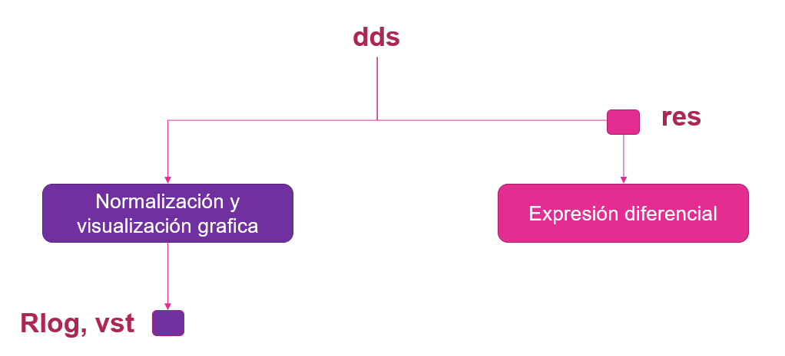
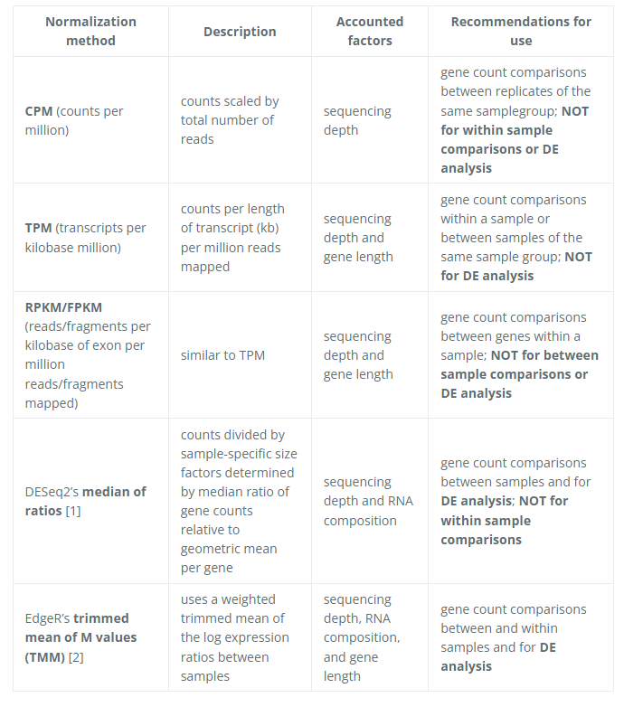
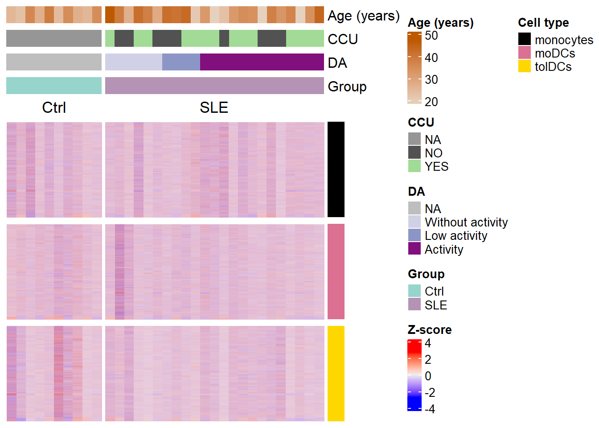
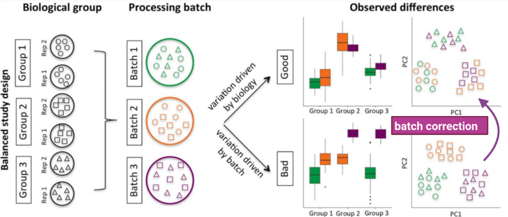
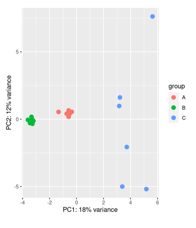
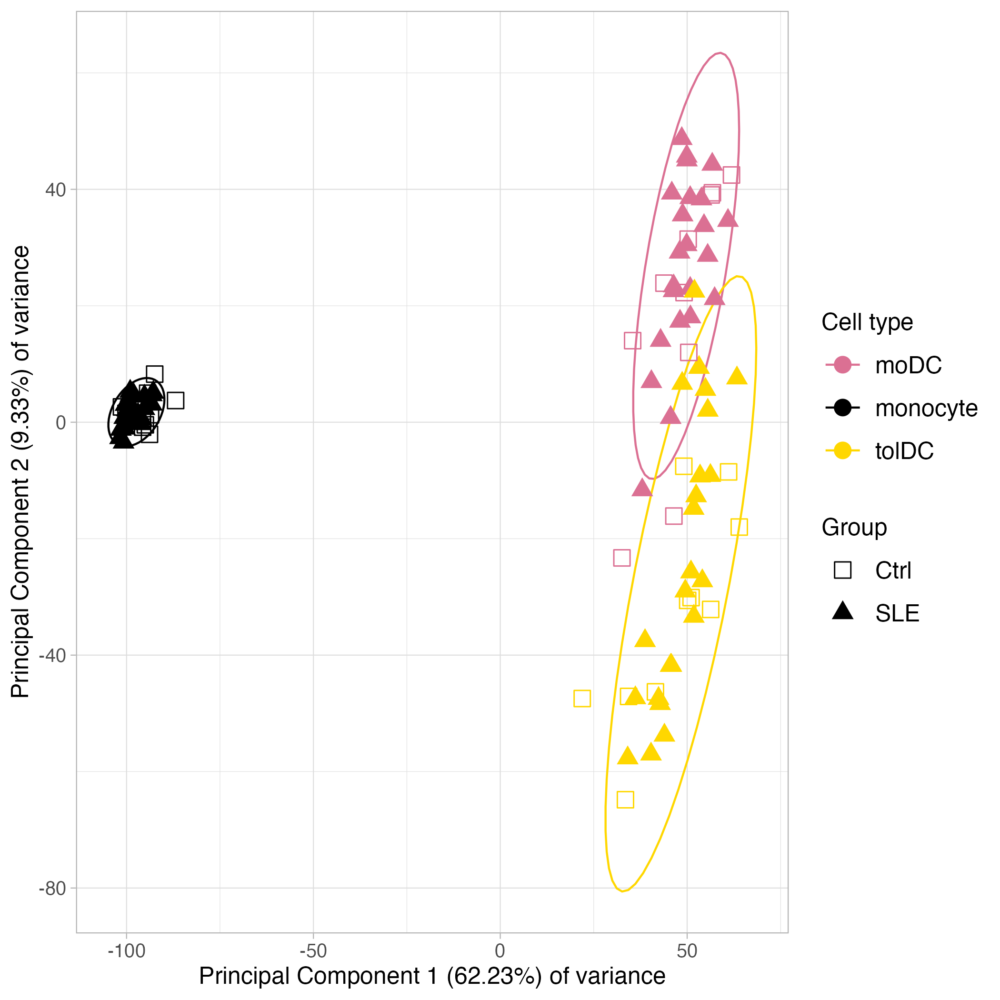
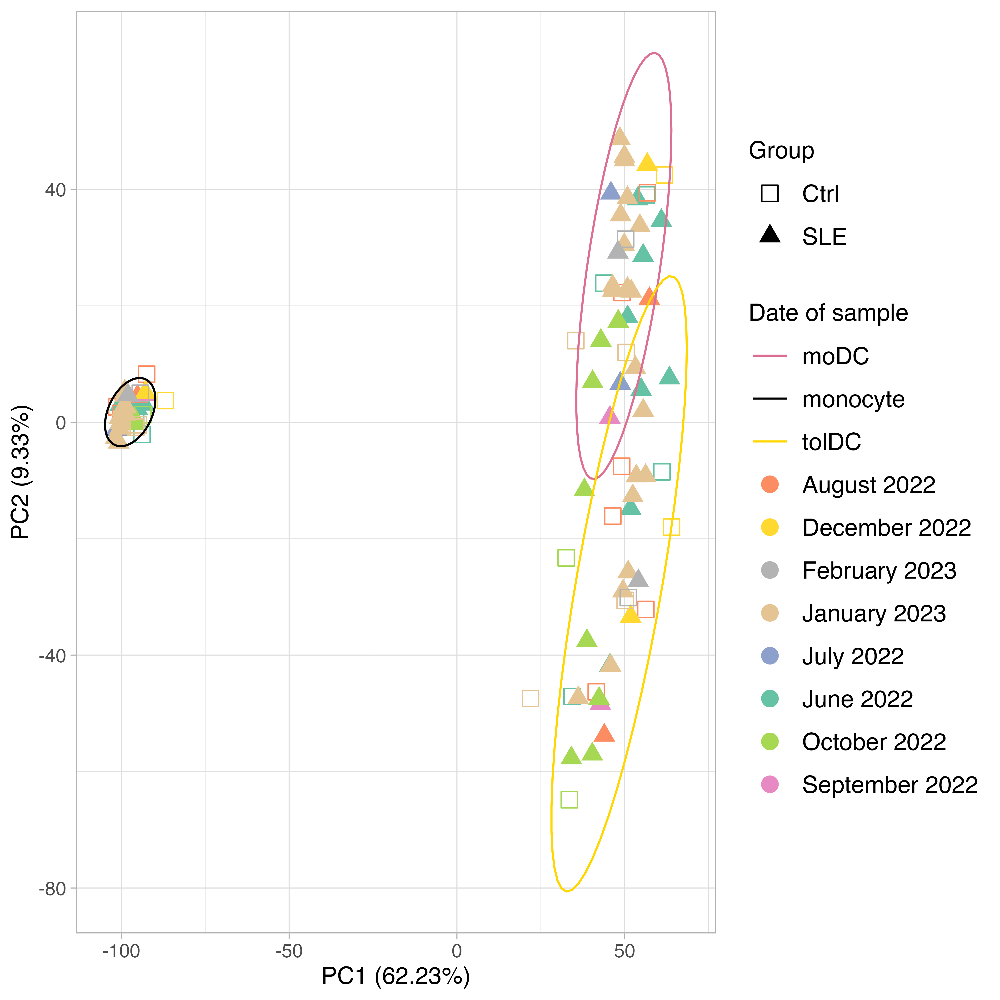
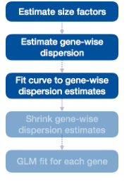
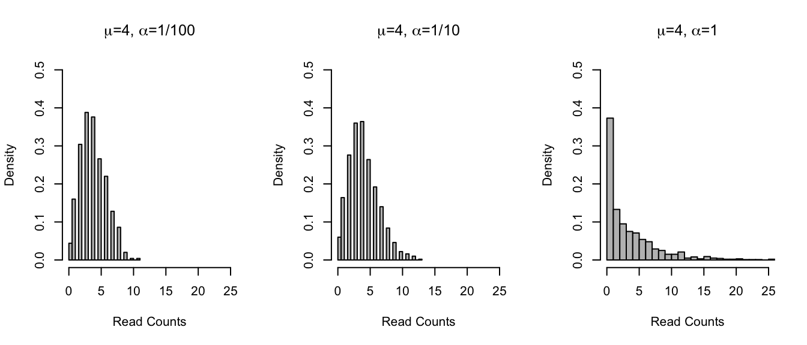
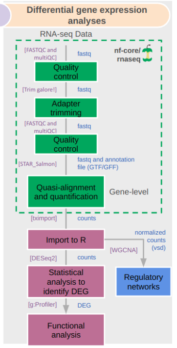

```{r setup, include = FALSE}
# Setup chunk
# Paquetes a usar
#options(htmltools.dir.version = FALSE) cambia la forma de incluir código, los colores

library(knitr)
library(tidyverse)
library(xaringanExtra)
library(icons)
library(fontawesome)
library(emo)

# set default options
opts_chunk$set(collapse = TRUE,
               dpi = 300,
               warning = FALSE,
               error = FALSE,
               comment = "#")

top_icon = function(x) {
  icons::icon_style(
    icons::fontawesome(x),
    position = "fixed", top = 10, right = 10
  )
}

knit_engines$set("yaml", "markdown")

# Con la tecla "O" permite ver todas las diapositivas
xaringanExtra::use_tile_view()
# Agrega el boton de copiar los códigos de los chunks
xaringanExtra::use_clipboard()

# Crea paneles impresionantes 
xaringanExtra::use_panelset()

# Para compartir e incrustar en otro sitio web
xaringanExtra::use_share_again()
xaringanExtra::style_share_again(
  share_buttons = c("twitter", "linkedin")
)

# Funcionalidades de los chunks, pone un triangulito junto a la línea que se señala
xaringanExtra::use_extra_styles(
  hover_code_line = TRUE,         #<<
  mute_unhighlighted_code = TRUE  #<<
)

# Agregar web cam
xaringanExtra::use_webcam()
```

```{r xaringan-editable, echo=FALSE}
# Para tener opciones para hacer editable algun chunk
xaringanExtra::use_editable(expires = 1)
# Para hacer que aparezca el lápiz y goma
xaringanExtra::use_scribble()
```


```{r xaringan-themer Eve, include=FALSE, warning=FALSE}
# Establecer colores para el tema
library(xaringanthemer)

palette <- c(
 orange        = "#fb5607",
 pink          = "#ff006e",
 blue_violet   = "#8338ec",
 zomp          = "#38A88E",
 shadow        = "#87826E",
 blue          = "#1381B0",
 yellow_orange = "#FF961C"
  )

#style_xaringan(
style_duo_accent(
  background_color = "#FFFFFF", # color del fondo
  link_color = "#562457", # color de los links
  text_bold_color = "#0072CE",
  primary_color = "#01002B", # Color 1
  secondary_color = "#CB6CE6", # Color 2
  inverse_background_color = "#00B7FF", # Color de fondo secundario 
  colors = palette,
  
  # Tipos de letra
  header_font_google = google_font("Barlow Condensed", "600"), #titulo
  text_font_google   = google_font("Work Sans", "300", "300i"), #texto
  code_font_google   = google_font("IBM Plex Mono") #codigo
  #text_font_size = "1.5rem" # Tamano de letra
)
# https://www.rdocumentation.org/packages/xaringanthemer/versions/0.3.4/topics/style_duo_accent
```

class: title-slide, middle, center
background-image: url(figures/HelloWorld_slide1.png) 
background-position: 90% 75%, 75% 75%, center
background-size: 1210px,210px, cover

.center-column[
# `r rmarkdown::metadata$title`
### `r rmarkdown::metadata$subtitle`

####`r rmarkdown::metadata$author` 
#### `r rmarkdown::metadata$date`
]

.footnote[ [R-Ladies Theme](https://www.apreshill.com/project/rladies-xaringan/)
]

---

class: inverse, center, middle

`r fontawesome::fa("chart-area", height = "3em")`
# 1. Normalización de los datos

---

.pull-left[

## ¿Qué significa normalizar?

Normalizar es ajustar los datos para que puedan compararse entre células.
- Imagina que cada célula es como un estudiante que entrega una lista de palabras escritas.
- Algunos escriben mucho, otros poco.
- Para poder comparar, necesitamos ponerlos en la misma “escala”.
]

.pull-right[  
```{r, echo=FALSE, out.width='100%', fig.align='center'}
knitr::include_graphics("figures/normalization_methods_composition.png")
```
]


.footnote[Imagen tomada de:
[Introduction to DGE - ARCHIVED](https://hbctraining.github.io/DGE_workshop/lessons/02_DGE_count_normalization.html)
]

---

## Normalización de los datos
### ¿Por qué es necesario normalizar?

Nuestros datos están sujetos a **sesgos técnicos** y **biológicos** que provocan **variabilidad** en las cuentas.

Si queremos hacer **comparaciones de niveles de expresión entre muestras** es necesario *ajustar* los datos tomando en cuenta estos sesgos.

- Análisis de expresión diferencial

- Visualización de datos

En general, siempre que estemos comparando expresión entre nuestros datos.

---
.pull-left[
## Métodos de normalización

Ejemplo: **DESEq2**

```{r, echo=FALSE, out.width='120%', fig.align='center'}

```

]

.pull-right[
```{r, echo=FALSE, out.width='120%', fig.align='center'}

```
]


.footnote[Imagenes provenientes de:
Revisa el [manual de DESEq](https://bioconductor.org/packages/devel/bioc/vignettes/DESeq2/inst/doc/DESeq2.html#contrasts); [Introduction to DGE - ARCHIVED](https://hbctraining.github.io/DGE_workshop/lessons/02_DGE_count_normalization.html#2-create-deseq2-object)
]

---

## Counts per million (CPM) o Reads per million (RPM) 

.pull-left[

`CPM o RPM = (C * N) / 1e6`

- C: Numero de reads mapeados (conteos) en el gen
- N: Numero total de reads mapeados

Ejemplo: Si tenemos 5 millones de reads o lecturas (M). Y la mayoría  de ellos alinean con el genoma (4 M). Encontramos un gen con 5000 reads. 

- ¿Cuál será su valor en CPM? 

`CPM o RPM = (5000 * 10^6) / (4 * 10^6) = 1250`

]

.pull-right[

> **NOTA:** El CPM no contempla el tamaño del gen en la normalización.  
>
> **NOTA:** 1e6 es lo mismo que 10^6.

Ejemplo:

```{r}
conteos <- c(100, 500, 1000)   # tres genes
total <- sum(conteos)          # total de lecturas
cpm <- (conteos / total) * 1e6 # equivalente a * 10^6
cpm
```

]


.footnote[
Para más ejemplos puedes verlos dando click [aquí](https://bio-protocol.org/exchange/protocoldetail?id=4462&type=1).
]

---

.pull-left[
## TPM (Transcripts Per Million)

- Considera: **Profundidad + longitud del gen, con proporcionalidad**
- Ventajas: Comparaciones más consistentes entre muestras
- Limitaciones: Requiere anotaciones precisas de longitud
- Fórmula: Se calcula a partir de los **RPK (Reads Per Kilobase)**:

  1. Se obtienen los RPK de todos los genes.
  2. Se suman todos los RPK.
  3. Cada RPK se divide por la suma y se multiplica por 10^6

Así, **TPM** es una versión escalada de RPK que permite comparar entre muestras.

]

.pull-right[

Ejemplo: 

```{r}
# 1. Calcular RPK (Reads Per Kilobase)
counts <- c(GeneA=1000, GeneB=500, GeneC=200)
lengths <- c(GeneA=2000, GeneB=500, GeneC=1000) # en bases

rpk <- counts / (lengths/1000)
rpk
# GeneA = 500, GeneB = 1000, GeneC = 200

# 2. Sumar todos los RPK
sum_rpk <- sum(rpk)  # 1700

# 3. Calcular TPM
tpm <- (rpk / sum_rpk) * 1e6
tpm
```

]

---

.pull-left[
## RPKM / FPKM (no recomendado)

- Considera: **Profundidad + longitud del gen**
- Ventajas: Historicamente usado
- Limitaciones: Menos robusto para comparar entre muestras
- Fórmula: (conteo / (longitud kb × total lecturas)) × 1e6

- Si bien los métodos de normalización **TPM** y **RPKM/FPKM** tienen en cuenta la profundidad de secuenciación y la longitud del gen, no se recomienda el uso de RPKM/FPKM. Esto se debe a que los valores de recuento normalizados que genera este método no son comparables entre muestras.

]

.pull-right[

Ejemplo:

```{r}
# Conteos y longitudes
counts <- c(GeneA=1000, GeneB=500, GeneC=200)
lengths <- c(GeneA=2000, GeneB=500, GeneC=1000) # bases
total_counts <- sum(counts)

# RPKM
rpkm <- (counts * 1e9) / (lengths * total_counts)

# Para FPKM, si fueran paired-end, counts serían fragmentos en vez de lecturas
fpkm <- rpkm  # misma fórmula, distinto insumo
rpkm  # Reads Per Kilobase of transcript per Million mapped reads
fpkm  # Fragments Per Kilobase of transcript per Million mapped fragments
```
]

---

class: inverse, center, middle

`r fontawesome::fa("chart-area", height = "3em")`
# 2. Normalización para la visualización de los datos con `DESEq2`

---

.pull-left[
## `rlog` y `vst` en `DESEq2`

Ambos sirven para transformar los conteos con fines de **visualización y exploración**, pero se usan en contextos distintos:

- Usa `rlog` si:
  + Tienes **pocas muestras** (ej. <30).
  + Tus datos presentan grandes diferencias en tamaño de biblioteca.
  + Necesitas una transformación más robusta para detección de outliers o análisis exploratorio detallado.

- Usa `vst` si:
  + Tienes **muchas muestras** (ej. >30).
  + Buscas velocidad y eficiencia sin perder estabilidad en la varianza.
  + Es más rápido y adecuado para datasets grandes.

]

.pull-right[
```{r, echo=FALSE, out.width='120%', fig.align='center'}

```


> **NOTA:** Podemos usar Z-scores, TPM, log2 Fold Change, cuentas normalizadas de `DESEq2` (`rlog` o `vst`) o el método que queramos solo para la visualización de datos normalizados, pero NO para usar el resultado en el análisis de expresión diferencial (DEG).
> 
> **Para DEG solo usaremos DESEq2 y edgeR como métodos confiables en estos análisis.**

]


---

## Empleo de Z-score para graficas

La normalización con **Z-score** transforma los datos para que cada gen tenga una media de 0 y una desviación estándar de 1. Esto permite comparar genes con diferentes niveles de expresión en la misma escala.

> Motivo: Los genes con varianza cero tienen la misma expresión en todas las muestras y no aportan información útil.

.pull-left[

```{r, eval=FALSE}
# 1) Filtar genes de varianza cero
var_non_zero <- apply(counts, 1, var) !=0 
# 2) Aplicar z-score
filtered_counts <- counts[var_non_zero, ]
# transponer
zscores <- t(scale(t(filtered_counts)))
dim(zscores) #[1] 18782   165
# 3) convertir a matriz
zscore_mat <- as.matrix(zscores)
```
]

.pull-right[
```{r, echo=FALSE, out.width='80%', fig.align='center'}

```
]

.footnote[Imagen tomada del GitHub: [SLE_Transcriptomic_analysis_tolerogenic](https://github.com/NeuroGenomicsMX/SLE_Transcriptomic_analysis_tolerogenic); relacionado con el artículo:
[Hernandez-Ledesma, Coss-Navarrete, *et-al*, *BioRxiv*](https://www.biorxiv.org/content/10.64898/2025.12.21.695630v1)
]


---

class: inverse, center, middle

`r fontawesome::fa("flask", height = "3em")`
# 3. Detección y corrección por *batch effect*

---

## Recordatorio: Corrección por *batch effect*

Buen diseño experimental con un minimo de 3 Réplicas biológicas, pero aún puede haber variación técnica.

```{r, echo=FALSE, out.width='60%', fig.align='center'}

```

.footnote[
Imagen proveniente de [Hicks, et al. 2015. bioRxiv](https://www.biorxiv.org/content/early/2015/08/25/025528)
]

---

.pull-left[
## Detección de *batch effect* mediante la reducción de dimensiones 

### Objetivos principales

- **Simplificar** los datos sin perder la señal biológica importante.
- **Eliminar ruido y redundancia** de genes poco informativos.
- Facilitar la visualización en 2D o 3D (`PCA, UMAP, t-SNE`).
- **Reduce la dimensionalidad** pero **NO reduce el número de variables en los datos**.
- **Cada dimensión o componente principal** generado por PCA será una **combinación lineal de las variables originales.**
]

.pull-right[.content-box-blue[
Interpretación: 

- **bulk RNA-seq - Cada punto = una muestra.**
- **scRNA-seq - Cada punto = una célula individual.**
- **La cercanía entre puntos** = *similitud* en sus perfiles de expresión.
- Clústeres o grupos = *poblaciones celulares distintas (tipos o estados)*.
- Colores = **categorías:** tipo celular, condición experimental, expresión de un gen específico, etc.
- Coordenadas: En `X` es la mayor proporción de la varianza. En `Y` la menor variabilidad.

```{r, echo=FALSE, out.width='40%', fig.align='center'}

```

]]

.footnote-right[ 
[Explicación completa de un UMAP](https://biostatsquid.com/umap-simply-explained/)]

---

## Paquetes para Corrección por *batch effect*

Algunos ejemplos:

- función [`ComBat`](https://www.rdocumentation.org/packages/sva/versions/3.20.0/topics/ComBat) del paquete [SVA](https://www.bioconductor.org/packages/release/bioc/html/sva.html)

- función [`removeBatchEffect`](https://web.mit.edu/~r/current/arch/i386_linux26/lib/R/library/limma/html/removeBatchEffect.html) del paquete [limma](https://bioconductor.org/packages/release/bioc/html/limma.html)

- Paquete [batchman](https://cran.r-project.org/web/packages/batchtma/vignettes/batchtma.html)

.footnote[
Para más ejemplos puedes verlos dando click [aquí](https://evayiwenwang.github.io/Managing_batch_effects/adjust.html#correcting-for-batch-effects).
]

---

## Visualización de la distribución de las muestras por **PCA**

.pull-left[
```{r, echo=FALSE, out.width='80%', fig.align='center'}

```
]

.pull-right[
```{r, echo=FALSE, out.width='80%', fig.align='center'}

```
]

.footnote[Imagenes tomadas del GitHub: [SLE_Transcriptomic_analysis_tolerogenic](https://github.com/NeuroGenomicsMX/SLE_Transcriptomic_analysis_tolerogenic); relacionado con el artículo:
[Hernandez-Ledesma, Coss-Navarrete, *et-al*, *BioRxiv*](https://www.biorxiv.org/content/10.64898/2025.12.21.695630v1)
]

---

class: inverse, center, middle

`r fontawesome::fa("chart-line", height = "3em")`
# 4. Normalización para el análisis de los DEG de los datos con `DESEq2`

---

## Teoría detrás de DESeq2

- **Input:** matrices de conteos crudos por gen y muestra.
- **Problema central:** los conteos de RNA-seq son discretos, dependen de la *profundidad de secuenciación y presentan una relación fuerte entre media y varianza*.
- **Modelo:** `DESeq2` ajusta un **modelo lineal generalizado (GLM)** con **distribución binomial negativa**.
- **Normalización:** aplica `size factors` para corregir diferencias de tamaño de librería.
- **Dispersión:** estima la *variabilidad biológica y técnica de cada gen*, aplicando “shrinkage” para estabilizar las estimaciones en datasets pequeños.
- **Inferencia:** combina estas estimaciones para probar hipótesis de expresión diferencial.

.footnote[
 [Manual de DESeq2](https://www.bioconductor.org/packages/release/bioc/vignettes/DESeq2/inst/doc/DESeq2.html#control-features-for-estimating-size-factors)
]

---

## Rol del `size factor` en `DESeq2`

.pull-left[ 
- Cada muestra tiene distinta profundidad de secuenciación (número total de lecturas).
- El `size factor` ajusta las cuentas crudas para que sean comparables entre muestras, eliminando ese sesgo técnico.
- La normalización con `size factors` asegura que las diferencias observadas en la expresión se deban a la **biología y no al tamaño de librería**.

]

.pull-right[  
```{r, echo=FALSE, out.width='80%', fig.align='center'}
knitr::include_graphics("figures/normalization_methods_composition.png")
```
]

.footnote[Imagen tomada de:
[Introduction to DGE - ARCHIVED](https://hbctraining.github.io/DGE_workshop/lessons/02_DGE_count_normalization.html)
]

---

## **DESeq2** emplea `size factor` (median of ratios) para normalizar las raw counts

.pull-left[
Cuando se emplea la función `DESeq()` internamente estan realizandose los siguientes procesos para **cada gen** empleando la prueba de **Wald**:

```{r, eval=FALSE}
# 1. Estimación de los factores de tamaño (size factor) (sj)
dds <- estimateSizeFactors(dds)
# 2. Estimación de la dispersión (𝛼𝑖) 
dds <- estimateDispersions(dds)
# 3. Ajuste del modelo lineal generalizado (GLM) de distribución binomial negativa para los coeficientes (𝛽𝑖) y cálculo de las estadísticas de Wald
dds <- nbinomWaldTest(dds)
```

]

.pull-right[
```{r, echo=FALSE, out.width='60%', fig.align='center'}

```
]

.footnote[
Para más ejemplos puedes verlos dando click [aquí](https://hbctraining.github.io/DGE_workshop_salmon_online/lessons/04b_DGE_DESeq2_analysis.html); [Manual de DESeq2](https://www.bioconductor.org/packages/release/bioc/vignettes/DESeq2/inst/doc/DESeq2.html#control-features-for-estimating-size-factors)
]

---

## ¿Por qué usa el test de **Wald**?

- El test de **Wald** evalúa si el coeficiente estimado (log2 fold change, βᵢ) es significativamente distinto de cero.
- Es adecuado para comparaciones directas entre dos condiciones (ej. tratamiento vs control).
- Permite obtener un ***valor p para cada gen***, que luego se ajusta por pruebas múltiples (FDR).
- Es más eficiente para contrastes simples que el test de **razón de verosimilitud (LRT)**, que se usa en diseños más complejos (ej. múltiples grupos o interacciones).

.footnote[
[Exploring DESeq2 results from the Wald test](https://hbctraining.github.io/Intro-to-DGE-Quarto/lessons/10_wald_test_results.html?utm_source=copilot.com); [Gene-level differential expression analysis with DESeq2](https://hbctraining.github.io/DGE_workshop_salmon/lessons/05_DGE_DESeq2_analysis2.html)
]

---

## ¿Por qué se basa en la **distribución binomial negativa (NB)**?

- Los conteos de RNA-seq muestran **sobre-dispersión**: la varianza es mayor que la media, lo que la distribución de Poisson no puede modelar.
- La **binomial negativa** introduce un parámetro de dispersión que permite capturar esta variabilidad extra.
- Esto refleja mejor la **realidad biológica**: genes con la misma media de expresión pueden tener distinta variabilidad entre muestras.
- Gracias a este modelo, `DESeq2` puede realizar **inferencias más robustas incluso con pocos replicados**.

.pull-left[
- La **Media** esta dada por:
$$
E[X] = \mu
$$
- La **varianza** está dada por:

$$
Var[X] = \mu + \frac{\mu^2}{\alpha}
$$
]

.pull-right[
Donde:

- $X$ corresponde al número de lecturas (conteos) que se asignan a un gen en una muestra.
- $\mu$ es la media de la distribución  
- $\alpha$ es el parámetro de dispersión, que captura la variación adicional respecto a la distribución de Poisson
]

.footnote[
[Exploring DESeq2 results from the Wald test](https://hbctraining.github.io/Intro-to-DGE-Quarto/lessons/10_wald_test_results.html?utm_source=copilot.com); [Gene-level differential expression analysis with DESeq2](https://hbctraining.github.io/DGE_workshop_salmon/lessons/05_DGE_DESeq2_analysis2.html); [Métodos de expresión diferencial](https://nbisweden.github.io/excelerate-scRNAseq/session-de/session-de-methods.html)
]

---

## Interpretación en RNA-seq

.pull-left[
- Los conteos de genes no siguen exactamente una Poisson porque la **varianza suele ser mayor que la media**.
- La binomial negativa introduce $\alpha$ para capturar esa **variabilidad extra**.
- Genes con la misma media ($\mu$) pueden tener distinta dispersión, reflejando diferencias biológicas o técnicas.

.content-box-blue[
- 📌 Conclusión:
  + Valores **pequeños** de $\alpha$ → gran sobre-dispersión, varianza muy alta.
  + Valores **grandes** de $\alpha$ → menos sobre-dispersión, varianza más cercana a la media.
  + En RNA-seq, DESeq2 estima $\alpha$ para cada gen porque distintos genes pueden tener distinta estabilidad en su expresión.
  ]
]

.pull-right[
- ¿Cómo se interpreta la variabilidad extra?
  + Si $\alpha$ **es pequeño** (ej. 1/100 = 0.01), el término $\frac{\mu^2}{\alpha}$ se vuelve **muy grande**
  + Esto significa que la **varianza es mucho mayor que la media**, reflejando una alta sobre-dispersión.
  + En la práctica: los conteos de ese gen fluctúan mucho más de lo que esperarías bajo una Poisson, incluso si la media $\mu$ es estable.
  
```{r, echo=FALSE, out.width='100%', fig.align='center'}

```

]

---

class: inverse, center, middle

`r fontawesome::fa("feather", height = "3em")`
## Tarea para el **Martes 28 de abril, 2026**
### Reporte de calidad de las secuencias crudas y procesadas, Visualización del pipeline propuesto

**Subir en la tarea de Google Classroom**

---

### Tarea
## Cada equipo debe entregarme un documento en formato `Rmd` o `Qmd` y `HTML` que contenga la siguiente información:

- Descripción de los datos (entregable 1).
- Explicación de las gráficas generadas por MultiQC sobre los **datos crudos** (entregable 2).
- Conclusión sobre los **datos crudos** (entregable 2): 
    + ¿Son viables para continuar con el análisis? 
    + ¿Qué pasos deben seguirse para mejorar la calidad de los datos?
- Explicación de las gráficas generadas por MultiQC sobre los **datos procesados** posterior a la limpieza de adaptadores y remoción de secuencias de mala calidad.
    + ¿Se eliminaron los adaptadores que contenian tus muestras? 
    + Tamaño del read inicial (datos crudos) y final (datos procesados)
- Crea un **diagrama de flujo** donde me muestres: inputs, ouputs, programas y los procesos a seguir, desde los datos crudos hasta el alineamiento.
- Realiza el alineamiento y conteo con los **datos procesados** e importa los datos en R (debes mostrarme el código y que la variable cargo correctamente, junto con sus dimensiones). 

**Subir en la tarea de Google Classroom**

---

.pull-left[
## Ejemplo de mi diagrama de flujo
]

.pull-right[

```{r, echo=FALSE, out.width='60%', fig.align='center'}

```
]

.footnote[Imagen relacionada con el artículo:
[Hernandez-Ledesma, Coss-Navarrete, *et-al*, *BioRxiv*](https://www.biorxiv.org/content/10.64898/2025.12.21.695630v1)
]

---

class: inverse, center, middle

`r fontawesome::fa("circle-nodes", height = "3em")`
# Ejercicio de repaso

---

# Ejercicio de repaso

- Descarga el archivo: [Practica3.qmd](https://eveliacoss.github.io/RNAseq_classFEB2026/Practica_Dia3/Practica_Normalizacion.qmd)
- Visualización del reporte final: [Practica3](https://eveliacoss.github.io/RNAseq_classFEB2026/Practica_Dia3/Practica_Normalizacion.html)

---

class: center, middle

`r fontawesome::fa("code", height = "3em")`
# Martes 28 de abril 2026  
## Análisis de expresión diferencial

Gracias por tu atención, respira y coméntame tus dudas. 