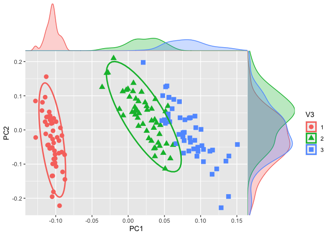

```{r setup, include = FALSE}
# Setup chunk
# Paquetes a usar
#options(htmltools.dir.version = FALSE) cambia la forma de incluir código, los colores

library(knitr)
library(tidyverse)
library(xaringanExtra)
library(icons)
library(fontawesome)
library(emo)

# set default options
opts_chunk$set(collapse = TRUE,
               dpi = 300,
               warning = FALSE,
               error = FALSE,
               comment = "#")

top_icon = function(x) {
  icons::icon_style(
    icons::fontawesome(x),
    position = "fixed", top = 10, right = 10
  )
}

knit_engines$set("yaml", "markdown")

# Con la tecla "O" permite ver todas las diapositivas
xaringanExtra::use_tile_view()
# Agrega el boton de copiar los códigos de los chunks
xaringanExtra::use_clipboard()

# Crea paneles impresionantes 
xaringanExtra::use_panelset()

# Para compartir e incrustar en otro sitio web
xaringanExtra::use_share_again()
xaringanExtra::style_share_again(
  share_buttons = c("twitter", "linkedin")
)

# Funcionalidades de los chunks, pone un triangulito junto a la línea que se señala
xaringanExtra::use_extra_styles(
  hover_code_line = TRUE,         #<<
  mute_unhighlighted_code = TRUE  #<<
)

# Agregar web cam
xaringanExtra::use_webcam()
```

```{r xaringan-editable, echo=FALSE}
# Para tener opciones para hacer editable algun chunk
xaringanExtra::use_editable(expires = 1)
# Para hacer que aparezca el lápiz y goma
xaringanExtra::use_scribble()
```


```{r xaringan-themer Eve, include=FALSE, warning=FALSE}
# Establecer colores para el tema
library(xaringanthemer)

palette <- c(
 orange        = "#fb5607",
 pink          = "#ff006e",
 blue_violet   = "#8338ec",
 zomp          = "#38A88E",
 shadow        = "#87826E",
 blue          = "#1381B0",
 yellow_orange = "#FF961C"
  )

#style_xaringan(
style_duo_accent(
  background_color = "#FFFFFF", # color del fondo
  link_color = "#562457", # color de los links
  text_bold_color = "#0072CE",
  primary_color = "#01002B", # Color 1
  secondary_color = "#CB6CE6", # Color 2
  inverse_background_color = "#00B7FF", # Color de fondo secundario 
  colors = palette,
  
  # Tipos de letra
  header_font_google = google_font("Barlow Condensed", "600"), #titulo
  text_font_google   = google_font("Work Sans", "300", "300i"), #texto
  code_font_google   = google_font("IBM Plex Mono") #codigo
  #text_font_size = "1.5rem" # Tamano de letra
)
# https://www.rdocumentation.org/packages/xaringanthemer/versions/0.3.4/topics/style_duo_accent
```

class: title-slide, middle, center
background-image: url(figures/HelloWorld_slide1.png) 
background-position: 90% 75%, 75% 75%, center
background-size: 1210px,210px, cover

.center-column[
# `r rmarkdown::metadata$title`
### `r rmarkdown::metadata$subtitle`

####`r rmarkdown::metadata$author` 
#### `r rmarkdown::metadata$date`
]

.left[.footnote[R-Ladies Theme[R-Ladies Theme](https://www.apreshill.com/project/rladies-xaringan/)]]

---

class: inverse, center, middle

`r fontawesome::fa("chart-area", height = "3em")`
# 1. Normalización de los datos

---

.pull-left[

## ¿Qué significa normalizar?

Normalizar es ajustar los datos para que puedan compararse entre células.
- Imagina que cada célula es como un estudiante que entrega una lista de palabras escritas.
- Algunos escriben mucho, otros poco.
- Para poder comparar, necesitamos ponerlos en la misma “escala”.
]

.pull-right[  
```{r, echo=FALSE, out.width='100%', fig.align='center'}
knitr::include_graphics("figures/normalization_methods_composition.png")
```
]


.footnote[Imagen tomada de:
[Introduction to DGE - ARCHIVED](https://hbctraining.github.io/DGE_workshop/lessons/02_DGE_count_normalization.html)
]

---

## Normalización de los datos
### ¿Por qué es necesario normalizar?

Nuestros datos están sujetos a **sesgos técnicos** y **biológicos** que provocan **variabilidad** en las cuentas.

Si queremos hacer **comparaciones de niveles de expresión entre muestras** es necesario *ajustar* los datos tomando en cuenta estos sesgos.

- Análisis de expresión diferencial

- Visualización de datos

En general, siempre que estemos comparando expresión entre nuestros datos.

---
.pull-left[
## Métodos de normalización

Ejemplo: **DESEq2**

```{r, echo=FALSE, out.width='120%', fig.align='center'}
knitr::include_graphics("figures/pipeline_normalizacion.png")
```

]

.pull-right[
```{r, echo=FALSE, out.width='120%', fig.align='center'}
knitr::include_graphics("figures/normalization.png")
```
]


.left[.footnote[.black[
Revisa el [manual de DESEq](https://bioconductor.org/packages/devel/bioc/vignettes/DESeq2/inst/doc/DESeq2.html#contrasts)
]]]

---

## Métodos de normalización

.pull-left[

#### **Counts per million (CPM)** o **Reads per million (RPM) **  

`CPM o RPM = C * 10^6/N`

- C: Numero de reads mapeados en el gen
- N: Numero total de reads mapeados

Ejemplo: Si tenemos 5 millones de reads o lecturas (M). Y la mayoría  de ellos alinean con el genoma (4 M). Encontramos un gen con 5000 reads. 

- ¿Cuál será su valor en CPM? 

`CPM o RPM = (5000 * 10^6) / (4 * 10^6) = 1250`

]

.pull-right[

> **NOTA:** El CPM no contempla el tamaño del gen en la normalización.   

> **NOTA:** Podemos usar Z-scores, TPM, log2 Fold Change, cuentas normalizadas de DESEq2 (rlog o vst) o el método que queramos solo para la visualización de datos normalizados, pero NO para usar el resultado en el análisis de expresión diferencial (DEG).
> 
> **Para DEG solo usaremos DESEq2 y edgeR como métodos confiables en estos análisis.**
]


.left[.footnote[.black[
Para más ejemplos puedes verlos dando click [aquí](https://www.reneshbedre.com/blog/expression_units.html).
]]]

---

## Empleo de Z-score para graficas

La normalización con **Z-score** transforma los datos para que cada gen tenga una media de 0 y una desviación estándar de 1. Esto permite comparar genes con diferentes niveles de expresión en la misma escala.

> Motivo: Los genes con varianza cero tienen la misma expresión en todas las muestras y no aportan información útil.

.pull-left[

```{r, eval=FALSE}
# 1) Filtar genes de varianza cero
var_non_zero <- apply(counts, 1, var) !=0 
# 2) Aplicar z-score
filtered_counts <- counts[var_non_zero, ]
# transponer
zscores <- t(scale(t(filtered_counts)))
dim(zscores) #[1] 18782   165
# 3) convertir a matriz
zscore_mat <- as.matrix(zscores)
```
]

.pull-right[
```{r, echo=FALSE, out.width='80%', fig.align='center'}
knitr::include_graphics("figures/SLE_heatmap_zscore.png")
```
]

.left[.footnote[.black[
[Gene expression profiling of dendritic cell tolerance dysfunction in women with Systemic lupus erythematosus, BioRxiv](https://www.biorxiv.org/content/10.64898/2025.12.21.695630v1)
]]]

---

## **DESeq2** emplea `size factor` (median of ratios) para normalizar las raw counts

.pull-left[
Cuando se emplea la funcion `DESeq` internamente estan realizandose los siguientes procesos para **cada gen**:

```{r, eval=FALSE}
dds <- estimateSizeFactors(dds)
dds <- estimateDispersions(dds)
dds <- nbinomWaldTest(dds)
```

[Manual de DESeq2](https://www.bioconductor.org/packages/release/bioc/vignettes/DESeq2/inst/doc/DESeq2.html#control-features-for-estimating-size-factors)
]

.pull-right[
```{r, echo=FALSE, out.width='60%', fig.align='center'}
knitr::include_graphics("figures/sizefactor.png")
```
]

.left[.footnote[.black[
Para más ejemplos puedes verlos dando click [aquí](https://hbctraining.github.io/DGE_workshop_salmon_online/lessons/04b_DGE_DESeq2_analysis.html).
]]]

---

class: inverse, center, middle

`r fontawesome::fa("terminal", height = "3em")`
# 4. Detección y corrección por *batch effect*

---

# Recordatorio: Corrección por *Batch effect*

Buen diseño experimental con un minimo de 3 Réplicas biológicas, pero aún puede haber variación técnica.

```{r, echo=FALSE, out.width='60%', fig.align='center'}
knitr::include_graphics("figures/batch_effect_pca2.png")
```

.left[.footnote[.black[
Imagen proveniente de [Hicks, et al. 2015. bioRxiv](https://www.biorxiv.org/content/early/2015/08/25/025528)
]]]

---

## Paquetes para Corrección por Batch effect

Algunos ejemplos:

- funcion [ComBat](https://www.rdocumentation.org/packages/sva/versions/3.20.0/topics/ComBat) del paquete [SVA](https://www.bioconductor.org/packages/release/bioc/html/sva.html)

- funcion [removeBatchEffect](https://web.mit.edu/~r/current/arch/i386_linux26/lib/R/library/limma/html/removeBatchEffect.html) del paquete [limma](https://bioconductor.org/packages/release/bioc/html/limma.html)

- Paquete [batchman](https://cran.r-project.org/web/packages/batchtma/vignettes/batchtma.html)

.left[.footnote[.black[
Para más ejemplos puedes verlos dando click [aquí](https://evayiwenwang.github.io/Managing_batch_effects/adjust.html#correcting-for-batch-effects).
]]]

---

# Detección de *batch effect*

## Análisis de Componentes Principales (PCA)

.pull-left[

Es una herramienta para el *análisis exploratorio* de los datos que permite visualizar la **variación presente de un set de datos** con muchas **variables**.

En X es la mayor proporción de la varianza.
En Y la menor variabilidad.

**Cada dimensión o componente principal** generado por PCA será una **combinación lineal de las variables originales.**

PCA **reduce la dimensionalidad** pero **NO reduce el número de variables en los datos**.

Para más información visita [Managing batch effects](https://evayiwenwang.github.io/Managing_batch_effects/detect.html).
]

.pull-right[
```{r, echo=FALSE, out.width='60%', fig.align='center'}
knitr::include_graphics("figures/pca_example.png")
```
]

---

## Ejemplo: PCA + densidad

.pull-left[

```{r, eval=F}
library(cowplot)
library(dplyr)
library(ggplot2)
```

Codigo proveniente de [Stackoverflow](https://stackoverflow.com/questions/73554215/how-to-add-density-plot-per-component-in-pca-plot-in-r).
]

.pull-right[
```{r, echo=FALSE, out.width='100%', fig.align='center'}

```
]

---
class: center, middle

`r fontawesome::fa("code", height = "3em")`
# Felicidades por terminar el curso
## Recuerda mandar tu trabajo final en equipo el **28 de marzo**