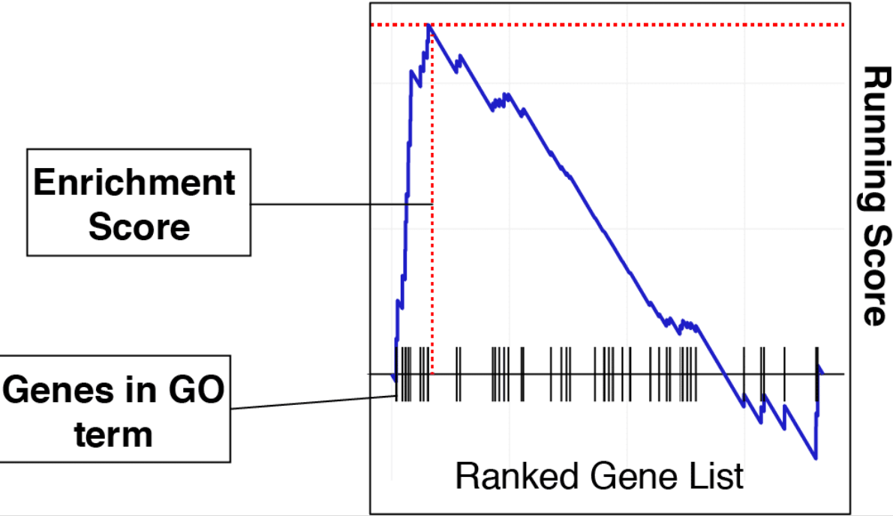
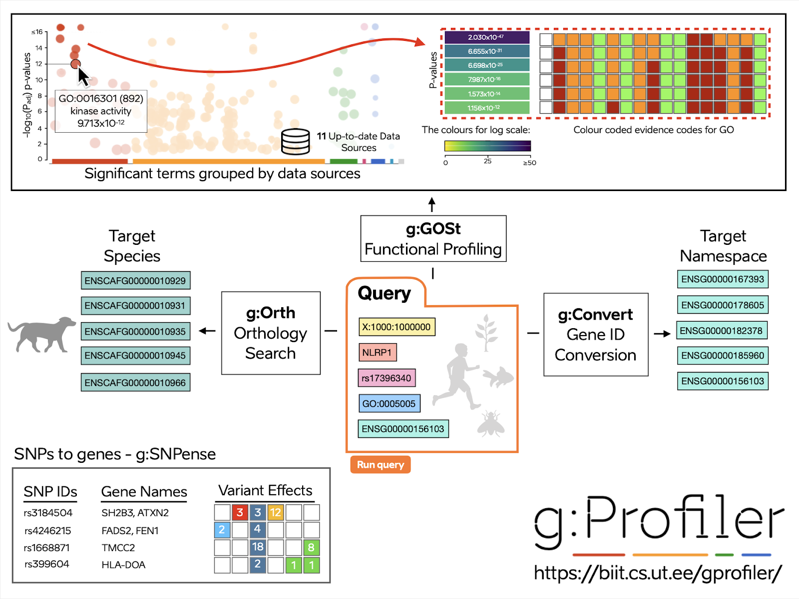
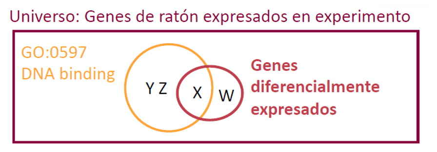
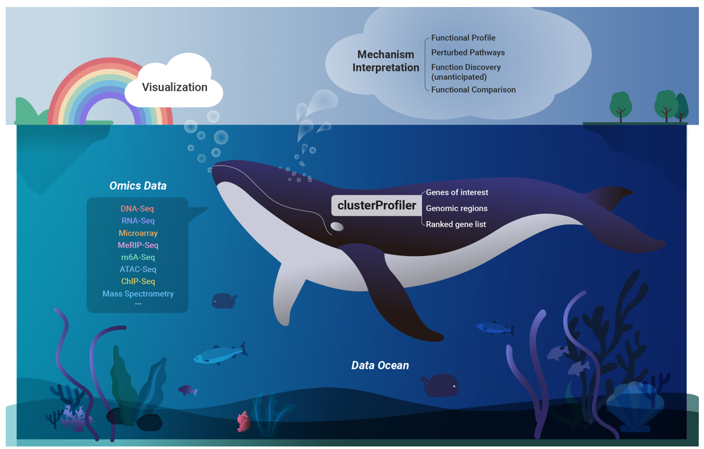
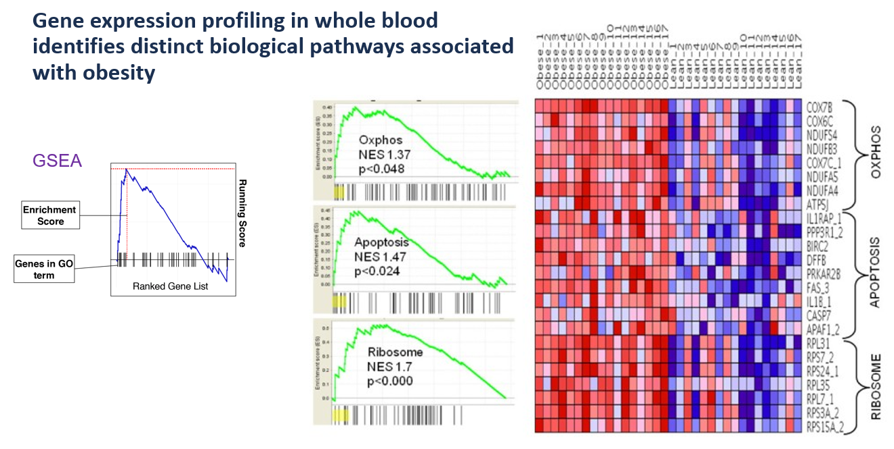
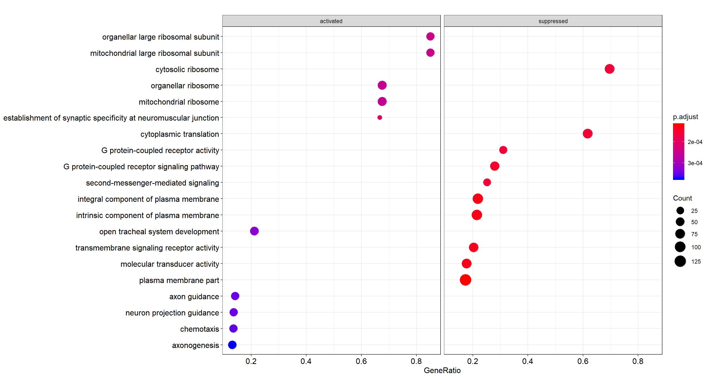
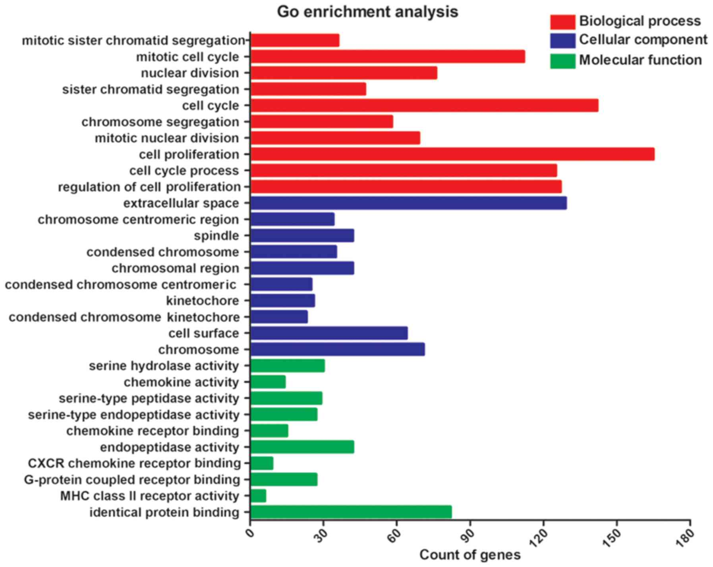
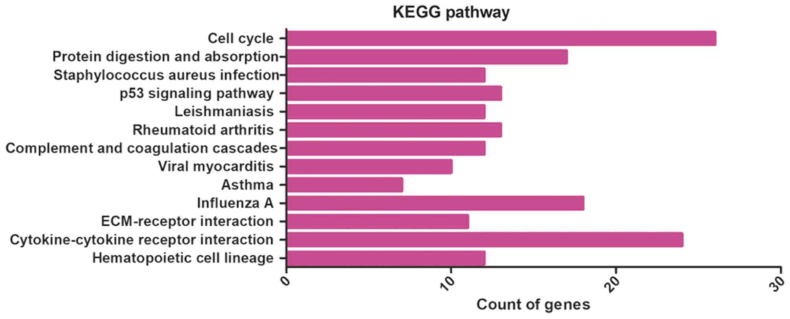
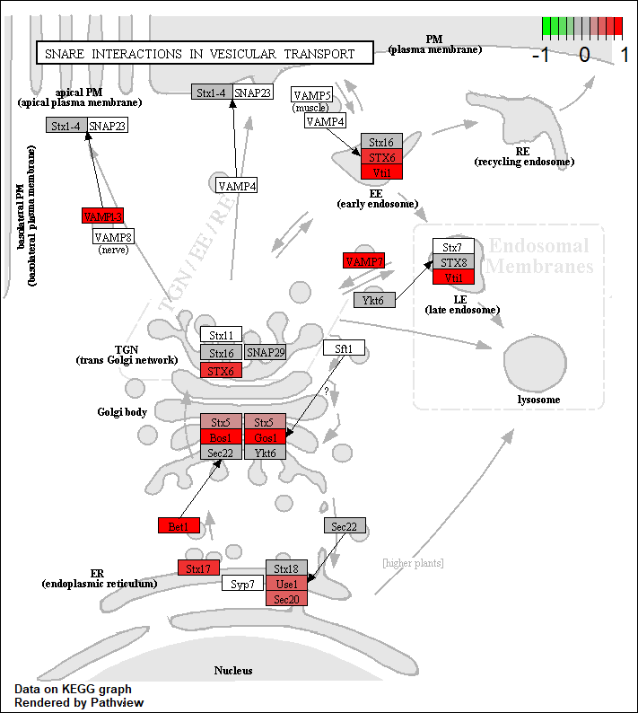
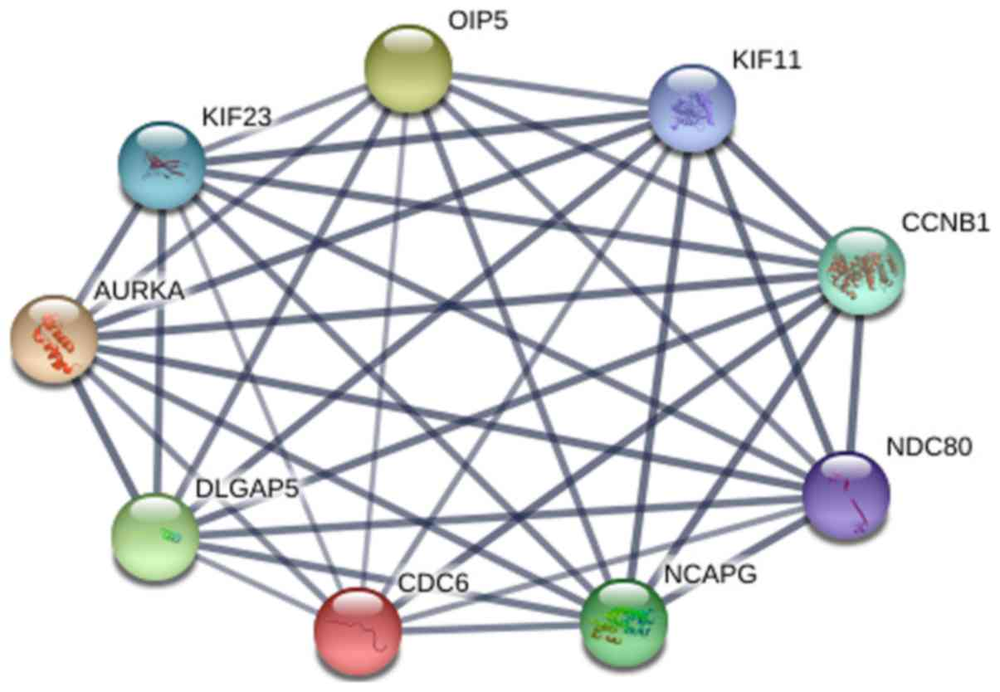

```{r setup, include = FALSE}
# Setup chunk
# Paquetes a usar
#options(htmltools.dir.version = FALSE) cambia la forma de incluir código, los colores

library(knitr)
library(tidyverse)
library(xaringanExtra)
library(icons)
library(fontawesome)
library(emo)

# set default options
opts_chunk$set(collapse = TRUE,
               dpi = 300,
               warning = FALSE,
               error = FALSE,
               comment = "#")

top_icon = function(x) {
  icons::icon_style(
    icons::fontawesome(x),
    position = "fixed", top = 10, right = 10
  )
}

knit_engines$set("yaml", "markdown")

# Con la tecla "O" permite ver todas las diapositivas
xaringanExtra::use_tile_view()
# Agrega el boton de copiar los códigos de los chunks
xaringanExtra::use_clipboard()

# Crea paneles impresionantes 
xaringanExtra::use_panelset()

# Para compartir e incrustar en otro sitio web
xaringanExtra::use_share_again()
xaringanExtra::style_share_again(
  share_buttons = c("twitter", "linkedin")
)

# Funcionalidades de los chunks, pone un triangulito junto a la línea que se señala
xaringanExtra::use_extra_styles(
  hover_code_line = TRUE,         #<<
  mute_unhighlighted_code = TRUE  #<<
)

# Agregar web cam
xaringanExtra::use_webcam()
```

```{r xaringan-editable, echo=FALSE}
# Para tener opciones para hacer editable algun chunk
xaringanExtra::use_editable(expires = 1)
# Para hacer que aparezca el lápiz y goma
xaringanExtra::use_scribble()
```


```{r xaringan-themer Eve, include=FALSE, warning=FALSE}
# Establecer colores para el tema
library(xaringanthemer)

palette <- c(
 orange        = "#fb5607",
 pink          = "#ff006e",
 blue_violet   = "#8338ec",
 zomp          = "#38A88E",
 shadow        = "#87826E",
 blue          = "#1381B0",
 yellow_orange = "#FF961C"
  )

#style_xaringan(
style_duo_accent(
  background_color = "#FFFFFF", # color del fondo
  link_color = "#562457", # color de los links
  text_bold_color = "#0072CE",
  primary_color = "#01002B", # Color 1
  secondary_color = "#CB6CE6", # Color 2
  inverse_background_color = "#00B7FF", # Color de fondo secundario 
  colors = palette,
  
  # Tipos de letra
  header_font_google = google_font("Barlow Condensed", "600"), #titulo
  text_font_google   = google_font("Work Sans", "300", "300i"), #texto
  code_font_google   = google_font("IBM Plex Mono") #codigo
  #text_font_size = "1.5rem" # Tamano de letra
)
# https://www.rdocumentation.org/packages/xaringanthemer/versions/0.3.4/topics/style_duo_accent
```

class: title-slide, middle, center
background-image: url(figures/HelloWorld_slide1.png) 
background-position: 90% 75%, 75% 75%, center
background-size: 1210px,210px, cover

.center-column[
# `r rmarkdown::metadata$title`
### `r rmarkdown::metadata$subtitle`

####`r rmarkdown::metadata$author` 
#### `r rmarkdown::metadata$date`
]

.left[.footnote[R-Ladies Theme[R-Ladies Theme](https://www.apreshill.com/project/rladies-xaringan/)]]

---

# Contenido de la clase

- 1) Análisis de Expresión diferencial

- 2) Gene Set Enrichment Analysis (GSEA) - Análisis funcional

- 3) Ejemplos de graficas

- 4) Última Práctica

---

class: inverse, center, middle

`r fontawesome::fa("laptop-code", height = "3em")`
# 1. DEG con DESeq2

---

## El análisis de expresión diferencial se realiza en pares

.pull-left[
Siempre vamos a comparar al **CONTROL (no tratado)** VS una **Condición (pacientes con SLE)**. Las comparaciones se realizan en pares.

#### Paso 1. Crear el objeto DESEq2

El diseño que debemos darle si usamos STAR sería:

```{r, eval=FALSE}
dds <- DESeqDataSetFromMatrix(countData = data, 
          colData = metadata,                   
          design = ~Group)                     
```

Si usamos Salmon o Kallisto sería:

```{r, eval=FALSE}
dds <- DESeqDataSetFromTximport(txi = txi,  
          colData = metadata,                     
          design = ~Group)                 
```

]

.pull-right[
```{r, echo=FALSE, out.width='100%', fig.align='center'}
knitr::include_graphics("figures/diseno_experimental.png")
```
]

---

### Paso 2. Selección de Contrastes (Contrasts)

Designando que la **referencia (ref)** es el control.

```{r, eval=FALSE}
dds$type <- relevel(dds$type, ref = "CONTROL") 
levels(dds$type)
## [1] "CONTROL"     "SLE"
```

Podemos renombrar contrastes

```{r, eval=FALSE}
levels(dds$type) <- c("control", "sle")
```

---

## Numero de transcriptomas

.pull-left[
Calcula el número total de transcriptomas generados considerando que se obtiene una muestra por paciente (**23 pacientes con SLE y 10 controles**) en las siguientes condiciones:

- **1)** Monocitos en estado basal.
- **2)** Monocitos diferenciados a moDCs.
- **3)** Monocitos diferenciados a tolDCs.
- **4)** Una muestra tras la estimulación con IMQ.
- **5)** Una muestra sin estimulación con IMQ.

¿Cuántos transcriptomas se obtuvieron en total?
]

.pull-right[
```{r, echo=FALSE, out.width='100%', fig.align='center'}
knitr::include_graphics("figures/SLE_desing.jpg")
```
]

--

**Respuesta:** Tenemos 165 transcriptomas por analizar.

---

## Podemos Filtrar información (opcional)

Podemos seleccionar por tipos celulares

```{r, eval=FALSE}
mo_df <- metadata[metadata$Cell_type == 'monocyte',]
mo_df$Group <-as.factor(mo_df$Group)
dim(mo_df) #33 6
```

Despues aplicamos esta información en el dds

```{r, eval=FALSE}
dds_mo <- dds[,mo_df$sample_ID]
dds_mo$Group <- relevel(dds_mo$Group, ref = 'Ctrl')
unique(dds_mo$Group)
# cambiamos el diseno
design(dds_mo) <- ~Group
save(dds_mo, file = paste0(ddsDir, 'dds_mo.RData'))
```

---

## Variables a considerar en el análisis de datos

.pull-left[
```{r, echo=FALSE, out.width='60%', fig.align='center'}
knitr::include_graphics("figures/SLE_desing2.jpg")
```
]

.pull-right[
```{r, echo=FALSE, out.width='50%', fig.align='center'}
knitr::include_graphics("figures/SLE_flow.jpg")
```
]

---

### Podemos unir información de las variables para crear una nueva categoría

En el siguiente ejemplo utilizamos datos de LUPUS, en donde tenemos 3 variables de interes: 

- `Group`: son las condiciones (control, paciente).

- `Cell_type`: Tipos celulares

- `Dose_category`: Dosis de corticoides solo en los pacientes.

- `SLEDAI_category`: Actividad de la enfermedad

```{r, eval=F}
dds <- DESeqDataSetFromTximport(txi = txi,
                                colData = metadata,
                                design = ~ Group + Dose_category + SLEDAI_category)
dds
```

Podemos crear una categoria que combine la informacion en las variables:

```{r, eval=F}
dds$Internal <- factor(paste(dds$SLEDAI_category, dds$Group, sep="_"))
```

---

## Podemos unir la información 3 variables por cada grupo

Extraer la informacion de controles y luego unir las variables de esta manera

```{r, eval=F}
dds$Internal <- factor(paste(dds$Dose_category, dds$Dose_category, dds$SLEDAI_category, sep="_"))

dds <- DESeqDataSetFromTximport(txi = filtered_txi,
                                colData = metadata,
                                design = ~ Internal)
dds
```


El script completo se encuentra en [DEG_analysis.R](https://github.com/EveliaCoss/RNAseq_classFEB2025/blob/main/Practica_Dia3/scripts/DEG_analysis.R).

---

### Paso 3. Análisis de expresión diferencial

```{r, eval=F}
dds_mo <- DESeq(dds_mo)

# estimating size factors
# estimating dispersions
# gene-wise dispersion estimates
# mean-dispersion relationship
# final dispersion estimates
# fitting model and testing
```

.footnote[
Para más información visita [Contrasts](https://www.bioconductor.org/packages/release/bioc/vignettes/DESeq2/inst/doc/DESeq2.html#control-features-for-estimating-size-factors).
]

---

### Paso 4. Obtener los resultados de la expresión diferencial entre los contrastes

```{r, eval=F}
# Opcion A
# results(dds, contrast = c("condition", "treated", "untreated"))
res_mo <- results(dds_mo, contrast=c("Group", "SLE", "Ctrl"))
res_mo_Ordered <- res_mo[order(res_mo$padj),]
summary(res_mo_Ordered)

# LFC > 0 (up)       : 121, 0.55%
# LFC < 0 (down)     : 23, 0.11%
# outliers [1]       : 0, 0%
#low counts [2]     : 7903, 36%

# Opcion B
resultsNames(dds_mo) # lists the coefficients
# [1] "Intercept"            "Group_SLE_vs_Ctrl"
res <- results(dds, name="Group_SLE_vs_Ctrl")
```

.footnote[
Para más información visita [Contrasts](https://www.bioconductor.org/packages/release/bioc/vignettes/DESeq2/inst/doc/DESeq2.html#control-features-for-estimating-size-factors).
]

---

## shrinkage

En estadística y en el contexto de `DESeq2`, shrinkage significa “contracción” o “regularización” de estimaciones.

- **¿Qué es shrinkage?**: Cuando estimamos parámetros como la dispersión o el `log2 fold change (βᵢ)` en datasets pequeños o con baja cobertura, las estimaciones pueden ser muy inestables.

- El shrinkage aplica un ajuste que “empuja” esas estimaciones extremas hacia valores más moderados, basándose en información global del dataset.

- Es una forma de regularización *bayesiana*: combina la información específica de cada gen con la información promedio de todos los genes.

- **Importancia:** Permite interpretar los cambios de expresión con mayor confianza, especialmente en datasets con **pocas réplicas**.


---

## Ejemplos en DESeq2

DESeq2 aplica shrinkage hacia una curva suavizada de **dispersión vs media**, estabilizando las estimaciones.

- `Dispersión (αᵢ)`: Cada gen tiene su propia dispersión, pero con pocos datos puede ser ruidosa.
- `Log2 fold change (βᵢ)`: Genes con baja expresión pueden mostrar fold changes exagerados.

El shrinkage reduce esos valores extremos, dando estimaciones más confiables para interpretación biológica.

---

## 📌 ¿Para qué se usa?

- **Interpretación biológica más robusta**
  + Evita fold changes exagerados en genes con poca información.
  + Permite identificar cambios de expresión que realmente son consistentes.
  + Evita falsos positivos debidos a estimaciones inestables.
- **Visualización y comunicación**
  + Los gráficos de volcanos o MA plots se ven más claros y menos dominados por outliers.
- **Comparación entre condiciones**
  + Facilita comparar genes y priorizar candidatos, porque los valores están regularizados.
  + Mejora la reproducibilidad de los resultados.

---

## Métodos disponibles en `lfcShrink()`

- `Normal prior (2014)`: usa un prior normal centrado en 0.
- `apeglm`: prior adaptativo tipo Student-t, más robusto para conteos bajos.
- `ashr`: mezcla de normales, ajusta mejor distribuciones complejas.

```{r, eval=F}
res <- results(dds)
# Opción A
res_shrink <- lfcShrink(dds, coef=2, type="apeglm")

# Opción B
# or to shrink log fold changes association with condition:
res <- lfcShrink(dds, coef="Group_SLE_vs_Ctrl", type="apeglm")
```

---

## Ejercicio 

### Instrucciones para el ejercicio con pasilla

- Descargar y abrir el script [Retroalimentación_Bioinfo2026.R](https://github.com/EveliaCoss/RNAseq_classFEB2026/blob/main/Retroalimentacion_Bioinfo2026.R)
- Descarguen el archivo .R y ábranlo en RStudio.

### Explicación breve de los datos

- **Organismo:** *Drosophila melanogaster* (mosca de la fruta).
- **Experimento:** Knockdown del gen *pasilla* mediante RNAi.
- **Relevancia:** El gen *pasilla* regula el splicing alternativo, por lo que su alteración afecta la expresión de muchos otros genes.
- **Formato:** Matriz de conteos de RNA-seq por gen, lista para análisis con herramientas como DESeq2 o edgeR.

---

## Pipeline bioinformática para RNA-seq

.pull-right[
```{r, echo=FALSE, out.width='80%', fig.align='center', fig.pos='top'}
knitr::include_graphics("figures/pipeline1.png")
```
]

.left[.footnote[.black[
Imagen proveniente de [mRNA-Seq data analysis workflow](https://biocorecrg.github.io/RNAseq_course_2019/workflow.html)
]]]

---

class: inverse, center, middle

`r fontawesome::fa("sitemap", height = "3em")`
# 2. Gene Set Enrichment Analysis (GSEA) - Análisis funcional

---

# Gene Set Enrichment Analysis (GSEA) - Análisis funcional

**Análisis de funcional de genes expresados o  diferencialmente expresados**

.pull-left[
- Comparación con una distribución hipergeométrica.

- [Ejemplo con m&ms](https://www.youtube.com/watch?v=udyAvvaMjfM)

```{r, echo=FALSE, out.width='40%', fig.align='center'}
knitr::include_graphics("figures/m&ms.jpg")
```

]

.pull-right[

```{r, echo=FALSE, out.width='100%', fig.align='center'}

```

]

.footnote[
Para más información visita [Bioinformatics Breakdown](https://bioinformaticsbreakdown.com/how-to-gsea/).
]

---

## Probabilidad de obtener 32 ISGs de mis 94 DEGs

Tienes **94 genes diferencialmente expresados (DEGs)** y observas que **32 de ellos son ISGs** (Interferon-Stimulated Genes). La pregunta es: ¿Cuál es la probabilidad de obtener 32 ISGs al azar dentro de esos 94 DEGs?

Esto se interpreta como un problema de **hipergeométrica**:

$$
P(X = k) = \frac{\binom{K}{k} \cdot \binom{N-K}{n-k}}{\binom{N}{n}}
$$

Donde:

- \(N\): número total de genes en el universo (ej. 20,000)  
- \(K\): número total de ISGs conocidos (ej. 300)  
- \(n\): número de DEGs (ej. 94)  
- \(k\): número de ISGs observados en tus DEGs (ej. 32)  

.footnote[
Código completo encontrado en: [ISG_hiper.qmd](https://github.com/EveliaCoss/RNAseq_classFEB2026/tree/main/Practica_Dia4/scripts/ISG_hiper.qmd).
]

---

## Probabilidad de obtener 32 ISGs de mis 94 DEGs

- **Idea clave:** Si los ISGs fueran seleccionados al azar, la probabilidad de que 32 de tus 94 DEGs sean ISGs es extremadamente baja.

- **Interpretación:** Esto sugiere que la respuesta de interferón está enriquecida en tu conjunto de genes diferencialmente expresados.

- **Aplicación:** Este tipo de análisis se usa para demostrar que un proceso biológico (como la respuesta inmune mediada por interferón) está realmente asociado con la condición estudiada.

```{r}
# Parámetros
N  <- 21718   # total de genes expresados 
K  <- 423     # total de ISGs conocidos, de Yu, et al 
n  <- 94      # número de DEGs
k  <- 32      # ISGs encontrados entre los DEGs, https://drive.google.com/file/d/1SIfY0fbtFOrq_9s8SFKGpHWnRGpT_NJq/view?usp=sharing , hay 2 repetidos, si no serian 34

# Probabilidad de obtener k o más ISGs por azar
p_value <- phyper(q = k - 1, m = K, n = N - K, k = n, lower.tail = FALSE)

p_value
```

---

## Análisis de prueba de Fisher

La prueba exacta de Fisher sirve para evaluar** si existe una asociación significativa entre dos variables categóricas** en una tabla de contingencia (normalmente 2×2).

- **Hipótesis nula:** Los ISGs aparecen en los DEGs con la misma probabilidad que en el resto de los genes.

- **Resultado esperado:** Un p-valor muy pequeño → evidencia de enriquecimiento de ISGs en tus DEGs.

- **Interpretación:** La respuesta de interferón está realmente asociada con la condición estudiada.

.footnote[
Código completo encontrado en: [ISG_hiper.qmd](https://github.com/EveliaCoss/RNAseq_classFEB2026/tree/main/Practica_Dia4/scripts/ISG_hiper.qmd).
]

---

## Análisis de prueba de Fisher

```{r}
# Paso 1. Construir la tabla de contingencia (tabla 2x2)
mat <- matrix(c(
  k,          # ISGs en DEGs
  n - k,      # No-ISGs en DEGs
  K - k,      # ISGs fuera de DEGs
  (N - K) - (n - k)  # No-ISGs fuera de DEGs
), nrow = 2, byrow = TRUE)

colnames(mat) <- c("ISG", "No_ISG")
rownames(mat) <- c("DEG", "No_DEG")

mat

# Paso 2. Aplicar el test de Fisher
fisher.test(mat, alternative = "greater")
# Si corres Fisher con alternative = "greater", el p‑value será muy cercano al del hypergeometric test.
```


---

```{r, echo=FALSE, out.width='80%', fig.align='center'}

```

.footnote[
Imagen tomada de [Galaxy Europe](https://usegalaxy-eu.github.io/posts/2019/11/20/gProfiler/).
]

---

.left[
```{r, echo=FALSE, out.width='30%', fig.align='center'}

```
]

## GSE function workflow para el paquete `gProfiler2`

### Inputs:

- `gene_list` = lista de genes en formato **vector** con los geneID en formato NCBI (EntrezID), Ensembl ID o Symbl.
- `Universo` = Todos los genes reportados en la base de datos, el paquete ya lo tiene pre-cargado.
- `pval` = P-value threshold proveniente del analisis

### Informacion:

- [Manual de gprofiler2](https://cran.r-project.org/web/packages/gprofiler2/vignettes/gprofiler2.html)
- [Pagina web](https://biit.cs.ut.ee/gprofiler/page/r)
- [Paper](https://www.ncbi.nlm.nih.gov/pmc/articles/PMC7859841/)

---
.left[
```{r, echo=FALSE, out.width='30%', fig.align='center'}

```
]

### Explicación sobre el análisis

```{r, echo=FALSE, out.width='50%', fig.align='center'}

```

### Existen otros paquetes

- fgsea, clusterProfiler, EnrichR, GORilla, topGO, AnnotationHub, goseq

---

```{r, echo=FALSE, out.width='80%', fig.align='center'}

```

.footnote[
Imagen tomada de [clusterProfiler](https://github.com/YuLab-SMU/clusterProfiler).
]

---

## Tipos de GOterm

- **BP :  Biological process**
  - Oligopeptide transport, response to abiotic stimulus, cell cycle 

- **MF :  Molecular function**
  - Identical protein binding, endopeptidase activity

- **CC : Celular component**
  - Apoplast, cell wall, extracellular region, cell surface

## KEGG pathway

- Rutas metabólicas / enzimáticas.

---

class: inverse, center, middle

`r fontawesome::fa("sitemap", height = "3em")`
# 3. Ejemplos de graficas

---

## Ejemplo - GSEA

```{r, echo=FALSE, out.width='80%', fig.align='center'}

```

.footnote[
Imagen tomada de [Ghosh, *et al*, 2010. *BMC Medical Genomics*](https://bmcmedgenomics.biomedcentral.com/articles/10.1186/1755-8794-3-56).
]

---

## Dotplot
### Tus primeros pasos

```{r, echo=FALSE, out.width='70%', fig.align='center'}

```


.footnote[
Imagen tomada de [NGS Analysis](https://learn.gencore.bio.nyu.edu/rna-seq-analysis/gene-set-enrichment-analysis/).
]

---

## Ejemplo - GOterms

```{r, echo=FALSE, out.width='50%', fig.align='center'}

```

.left[.footnote[.black[
Imagen tomada de [Chen, *et al*, 2019 *Mol Med Rep*](https://pubmed.ncbi.nlm.nih.gov/30569111/).
]]]

---

## Ejemplo - KEGG

```{r, echo=FALSE, out.width='80%', fig.align='center'}

```

.footnote[
Imagen tomada de [Chen, *et al*, 2019 *Mol Med Rep*](https://pubmed.ncbi.nlm.nih.gov/30569111/).
]

---

## Ejemplo - KEGG 
### Visualizacion de ruta en R

```{r, echo=FALSE, out.width='40%', fig.align='center'}

```

.footnote[
Imagen tomada de [NGS Analysis](https://learn.gencore.bio.nyu.edu/rna-seq-analysis/gene-set-enrichment-analysis/).
]

---

## Redes de regulación

Pueden realizarlo en [STRING](https://string-db.org/)

```{r, echo=FALSE, out.width='50%', fig.align='center'}

```

.left[.footnote[.black[
Imagen tomada de [Chen, *et al*, 2019 *Mol Med Rep*](https://pubmed.ncbi.nlm.nih.gov/30569111/).
]]]

---

class: inverse, center, middle

`r fontawesome::fa("terminal", height = "3em")`
# 4. Última Práctica

---

### Pipeline

>  Especie: *Mus musculus*, Alineamiento: STAR, Conteo: STAR

- Script [`load_data_inR.R`](https://github.com/EveliaCoss/RNAseq_classFEB2024/blob/main/Practica_Dia3/scripts/load_data_inR.R):

  **1)** Importar datos en R (archivo de cuentas) + metadatos y **2)** Crear una matriz de cuentas con todos los transcriptomas. 

- Script [`DEG_analysis.R`](https://github.com/EveliaCoss/RNAseq_classFEB2024/blob/main/Practica_Dia3/scripts/DEG_analysis.R):

  **3)** Crear el archivo `dds` con `DESeq2`, **4)** Correr el análisis de Expresión Diferencial de los Genes (DEG), **5)** Normalización de los datos, **6)** Detección de batch effect y **7)** Obtener los resultados de los contraste de DEG. Input: [raw_counts.csv](https://github.com/EveliaCoss/RNAseq_classFEB2024/blob/main/Practica_Dia2/data/raw_counts.csv) y  [metadata.csv](https://github.com/EveliaCoss/RNAseq_classFEB2024/blob/main/Practica_Dia2/data/metadata.csv)

- Script [`VisualizacionDatos.R`](https://github.com/EveliaCoss/RNAseq_classFEB2024/blob/main/Practica_Dia3/scripts/VisualizacionDatos.R):

  **8)** Visualización de los datos

- Script [`GOterms_analysis.R`](https://github.com/EveliaCoss/RNAseq_classFEB2024/blob/main/Practica_Dia4/scripts/GOterms_analysis.R):

  **9)** Análisis de términos funcionales (GO terms)

---

### Pipeline

>  Especie: *Homo sapiens*, Alineamiento: STAR, Conteo: Salmon

- Revisar los archivos html del GitHub [SLE_Transcriptomic_analysis_tolerogenic](https://github.com/NeuroGenomicsMX/SLE_Transcriptomic_analysis_tolerogenic/tree/main/docs). Nota: el libro se abre desde index.html

- Preprint: [Gene expression profiling of dendritic cell tolerance dysfunction in women with Systemic lupus erythematosus](https://www.biorxiv.org/content/10.64898/2025.12.21.695630v1)

---
class: inverse, center, middle

`r fontawesome::fa("laptop-code", height = "3em")`
# Buenas prácticas de programación
## Documentación de tu código

---
 
## Buenas prácticas de programación: Set up de tu trabajo 📌

Es buena idea comenzar **todos** tus scripts con las mismas líneas de código que indiquen lo siguiente:

.content-box-gray[
- *Título de tu programa*
- *Autor (author)*: Su nombre
- *Fecha (date)*: Fecha de creación
- *Propósito general de tu programa (Description)*: ¿Para qué sirve el programa? Ej: El siguiente programa realiza la suma de dos numeros enteros a partir de la entrada del usuario y posteriormente la imprime en pantalla.
- *Usage* ¿Cómo se utiliza?
- *Paquetes (packages)*
- *Directorio de trabajo (Working directory)*: En que carpeta se encuentra tu datos y programa.
  - *Directorio de input*: aquí estan guardados los datos que vas a usar en el programa
  - *Directorio de output*: aquí es donde vas a guardar tus resultados
- *Argumentos (Arguments)*
  - *Información de entrada (Data Inputs)*: Ej: Solo numeros enteros (sin decimales).
  - *Información de salida (Outpus)*: Graficas, figuras, tablas, etc.
- Líneas en donde cargues los datos que vas a usar
]

Ejemplo de Bonita documentación de codigo da click [aqui](https://github.com/mdozmorov/dcaf/tree/master/ngs.rna-seq)

---

class: center, middle

`r fontawesome::fa("code", height = "3em")`
# Felicidades por terminar el curso
## Recuerda mandar tu trabajo final en equipo el **jueves 21 de mayo**
### Clase de retroalimentación + pizza el **jueves 28 de mayo**